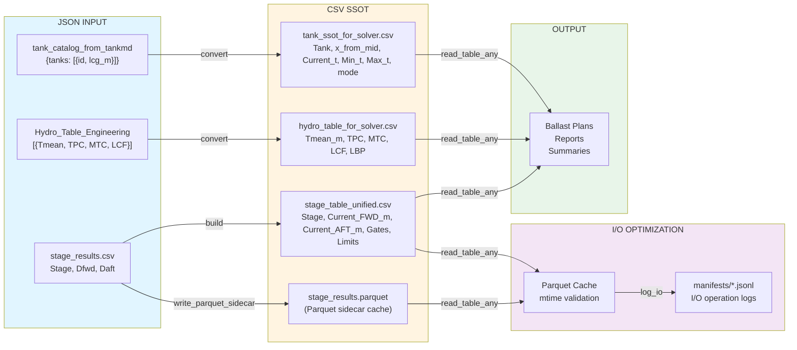
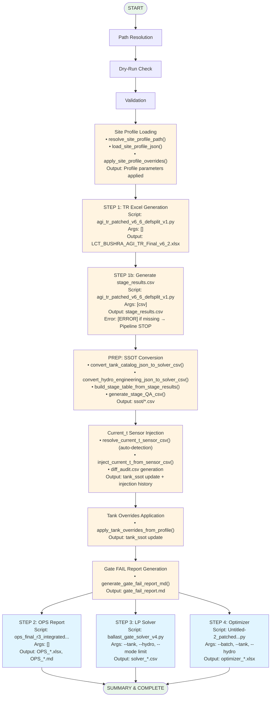
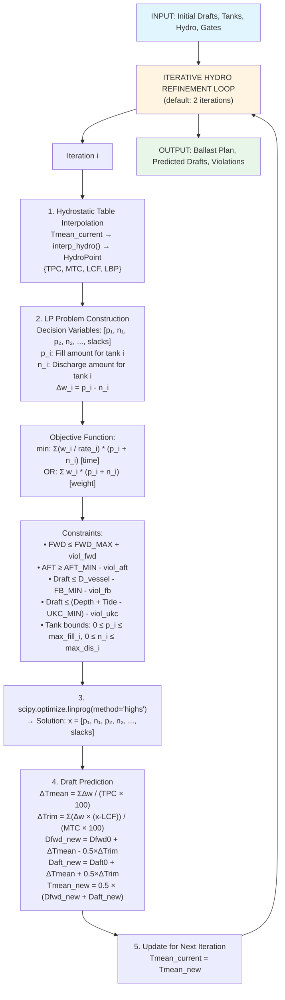
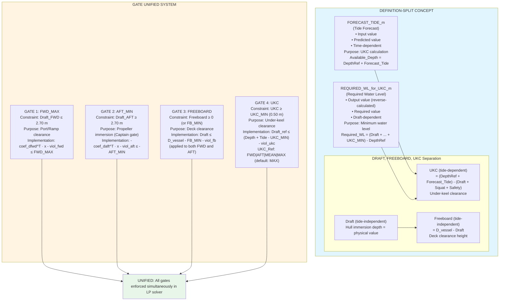
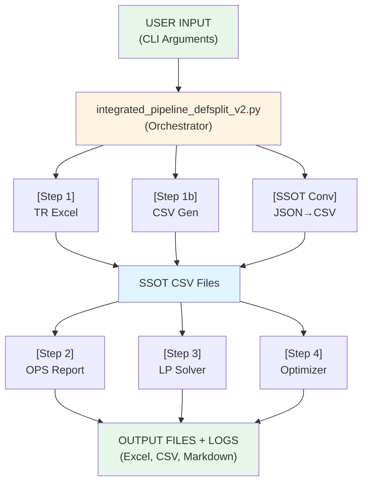

 `00_System_Architecture_Complete.md`:

Ballast Pipeline System Architecture Integrated Document

*Date:** 2025-12-20
**Version:** v3.9 (Updated: 2025-12-29)
**Purpose:** Integrated overview of the entire Ballast Pipeline system architecture

**Latest Update (v3.9 - 2025-12-29):**

- Added input data sources and search order (bplus_inputs folder structure)
- Detailed pipeline step-by-step input file mapping
- Specified Tide Integration priority

**Latest Update (v3.8 - 2025-12-29):**

- Added complete pipeline execution file list (21 files, categorized)
- Expanded component interface map (including Step 0, Step 5, post-processing, utilities)
- Classified by execution method (subprocess, import module, dynamic import)
- Specified activation conditions and dependency relationships

**Latest Update (v3.7 - 2025-12-29):**

- Forecast_Tide_m priority change: CLI `--forecast_tide` value takes highest priority
  - Ensures complete consistency of `Forecast_Tide_m` between `stage_table_unified.csv` and `solver_ballast_summary.csv`
  - For details, refer to `17_TIDE_UKC_Calculation_Logic.md` section 17.6.5

**Latest Update (v3.6 - 2025-12-28):**

- Option 2 implementation: BALLAST_SEQUENCE option/execution separation
  - `BALLAST_OPTION.csv`: Planning level (Delta_t centered, includes Priority, Rationale)
  - `BALLAST_EXEC.csv`: Execution sequence (Start_t/Target_t carry-forward, excludes Stage 6B)
  - `generate_sequence_with_carryforward()`: Tank state tracking and chain implementation
  - `generate_option_plan()`: Option plan generation (includes all Stages)
  - Added "Ballast_Option" and "Ballast_Exec" sheets to Excel export
- Option 1 patch proposal (not implemented)
  - Bryan Pack Forecast_tide_m injection (merge from pipeline_stage_QA.csv)
  - Stage 5_PreBallast GateB critical enforcement (AGI rule)
  - Current_* vs Draft_* unification (QA table)

**Latest Update (v3.5 - 2025-12-27):**

- Added `tide/tide_ukc_engine.py` SSOT engine documentation
- Documented Tide Integration Option B Hybrid (3-tier fallback: tide_windows → stage_schedule → constant)
- Updated backup folder README (reflected actual file list, detailed spmt/ directory files)
- Added tide_ukc_engine.py to component interface map

**Previous Update (v3.4 - 2025-12-27):**

- Tide Integration (AGI-only): Pre-Step tide stage mapping, stage-wise Forecast_tide_m
- Enhanced UKC calculation: Tide-dependent UKC, Tide_required_m reverse calculation, Tide_margin_m, Tide_verdict
- AUTO-HOLD Warnings: Automatic warnings for holdpoint stages (Stage 2, Stage 6A_Critical)
- Consolidated Excel: Automatic TIDE_BY_STAGE sheet generation
- SPMT Integration: spmt_unified.py, spmt_integrated_excel.py, Bryan template integration
- Added Step 5: Bryan Template Generation (includes SPMT cargo)

**Latest Update (v3.3 - 2025-12-27):**

- AGENTS.md SSOT integration (coordinate system, Gate definitions, Tank Direction SSOT)
- Clarified coordinate system constants and conversion formulas (Frame↔x conversion, sign rules)
- Added Tank Direction SSOT (FWD/AFT Zone classification, Golden Rule)
- Clarified Gate definitions (Gate-A: AFT_MIN_2p70, Gate-B: FWD_MAX_2p70_critical_only)
- Clarified Draft vs Freeboard vs UKC distinction

**Latest Update (v3.2 - 2025-12-27):**

- SSOT Stage definition integration (AGI-only, stage_results.csv SSOT enforcement)
- Improved Preballast fallback (uses preballast_min_t, safer fallback)
- FR_PREBALLAST safety (changed to 22.0, prevents extreme aft)
- One-time warning logic (early misconfiguration detection)

**Latest Update (v3.1 - 2025-12-27):**

- Current_t auto-detection feature (automatic detection of current_t_*.csv pattern)
- diff_audit.csv generation (sensor injection history recording)
- GM verification v2b (CLAMP detection, FSM status check, VERIFY_CLAMP_RANGE/VERIFY_FSM_MISSING)
- GM Grid axis alignment (DISP×TRIM standardization, grid_axis metadata)

**Latest Update (v3.0 - 2025-12-25):**

- SSOT Phase 1 integration (ssot/ module - gates_loader, draft_calc, validators)
- B-1 Critical Patches (Pump capability, Tank operability)
- P0/P1 Phase completion (Sequence generator, B+ Preflight, Hold point, Valve lineup)
- Modified Option 4 strategy (Forward Inventory: FWB2 28.50t/side)
- Excel Formula Preservation (COM post-processing)
- Added Step 4b (Ballast Sequence Generation)

---

## Table of Contents

1. [System Overview](#1-system-overview)
2. [Overall Architecture Diagram](#2-overall-architecture-diagram)
3. [Data Flow Architecture](#3-data-flow-architecture)
4. [Execution Flow Architecture](#4-execution-flow-architecture)
5. [LP Solver Architecture](#5-lp-solver-architecture)
6. [Definition-Split &amp; Gates Architecture](#6-definition-split--gates-architecture)
7. [Component Interface Map](#7-component-interface-map)
8. [Pipeline Execution File List](#8-pipeline-execution-file-list)

---

## 1. System Overview

### 1.1 Purpose

Ballast Pipeline is an integrated pipeline for automating and optimizing **Ballast Management** operations for vessels.

**Core Features:**

- SSOT (Single Source of Truth): Integrated management of Gate/Tank/Site profiles
- Definition Split: Clear separation of tide forecast and required water level
- Gate Unified System: Simultaneous enforcement of FWD/AFT/Freeboard/UKC gates
- Linear Programming-based optimization
- Automation of 6 independent sequential steps (Step 1~5)
- Operations ready: Automatic generation of Sequence/Checklist/Valve lineup
- B+ Preflight: Pre-validation of input data integrity
- Hold Point: Recalculation based on real-time measurements
- Forward Inventory: AFT draft control strategy
- Current_t auto-detection: Automatic detection and injection of sensor CSV files
- diff_audit.csv: Automatic recording of sensor injection history
- Enhanced GM verification: CLAMP range detection, FSM coefficient verification, GM_eff calculation
- **Tide Integration (AGI-only)**: Stage-wise tide mapping, UKC calculation, AUTO-HOLD warnings
- **SPMT Integration**: Cargo input generation, Bryan template integration
- **Consolidated Excel**: Automatic TIDE_BY_STAGE sheet generation
- **I/O Optimization (PR-01~05)**: Polars lazy scan, Parquet cache, Manifest logging
- **MAMMOET Calculation Sheet**: Technical calculation document generator

### 1.2 Key Features

- **AGI-Specific**: AGI site-specific pipeline (parameters managed via profile JSON)
- **SSOT Integration**: JSON Schema-based validation, single source of truth principle
- **Iterative Refinement**: Improved accuracy through Hydrostatic Table re-interpolation
- **Definition-Split Enforcement**: Clear separation of Draft/Freeboard/UKC concepts
- **Production Ready**: 100% reproducibility, Modified Option 4 validation complete

---

## 2. Overall Architecture Diagram

```mermaid
graph TB
    subgraph Input["INPUT LAYER (JSON SSOT + Sensors + Tide)"]
        TankJSON["tank_catalog_AGI_with_operability.json<br/>{tanks: [{operability, pump_access}]}"]
        SiteProfile["site_profile_AGI.json<br/>{gates, pump_scenarios, overrides}"]
        HydroJSON["Hydro_Table_Engineering.json"]
        SensorData["sensors/current_t_sensor.csv<br/>(Modified Option 4:<br/>FWB2 P/S = 28.50t)"]
        ValveMap["valve_map.json"]
        TideTable["bplus_inputs/water tide_202512.xlsx<br/>(AGI-only: time-series tide)"]
        TideWindows["bplus_inputs/tide_windows_AGI.json<br/>(AGI-only: stage time windows)"]
    end

    subgraph SSOTLayer["SSOT MODULE LAYER"]
        GatesLoader["ssot/gates_loader.py<br/>• Gate definitions (AFT_MIN_2p70, FWD_MAX_2p70_critical_only)<br/>• Tank operability<br/>• Ballast plan validation"]
        DraftCalc["ssot/draft_calc.py<br/>• AGENTS.md Method B<br/>• LCF/LBP-based drafts"]
        Validators["ssot/validators.py<br/>• B+ Preflight validation"]
    end

    subgraph IOLayer["I/O OPTIMIZATION LAYER (PR-01~05)"]
        Manifest["perf_manifest.py<br/>• Subprocess-safe JSONL logging<br/>• Run ID based manifest files<br/>• I/O operation tracking"]
        Detect["io_detect.py<br/>• 1-pass encoding detection<br/>• Delimiter auto-inference"]
        FastCSV["io_csv_fast.py<br/>• Polars lazy scan (priority)<br/>• pandas fallback (pyarrow/c/python)<br/>• Manifest logging"]
        ParquetCache["io_parquet_cache.py<br/>• Parquet sidecar cache<br/>• mtime-based validation<br/>• Cache hit/miss logging<br/>• read_table_any() unified API"]
    end

    subgraph Orchestrator["ORCHESTRATOR (Single Entry Point)"]
        MainPipeline["integrated_pipeline_defsplit_v2_gate270_split_v3.py"]
        BPreflight["B+ Preflight (P1-1)<br/>• Input/Physics/Gate/SSOT validation"]
        PreStepTide["Pre-Step: Tide Stage Mapping (AGI-only)<br/>• tide_stage_mapper.py<br/>• tide/tide_ukc_engine.py (SSOT)<br/>• stage_tide_AGI.csv"]
        Step1["Step 1: TR Excel + SSOT gates"]
        Step1b["Step 1b: stage_results.csv<br/>• Merges stage_tide_AGI.csv"]
        SSOTConv["SSOT Conversion<br/>• Tank catalog → CSV<br/>• Hydro table → CSV<br/>• Stage table build (with Tide data)<br/>• Forward Inventory (AFT-min)"]
        SSOTCSV["SSOT CSV LAYER<br/>• tank_ssot_for_solver.csv<br/>• tank_ssot_for_solver__aftmin.csv<br/>• hydro_table_for_solver.csv<br/>• stage_table_unified.csv<br/>• stage_tide_AGI.csv (AGI-only)"]
    end

    subgraph Steps["EXECUTION STEPS"]
        Step2["Step 2: OPS Report"]
        Step3["Step 3: LP Solver<br/>• Operability enforcement<br/>• Pump scenario<br/>• DISCHARGE_ONLY bounds<br/>• UKC calculation (tide-dependent)<br/>• Tide_required_m, Tide_margin_m, Tide_verdict"]
        Step4["Step 4: Optimizer"]
        Step4b["Step 4b: Sequence Generator (P0-2, Option 2)<br/>• ballast_sequence_generator.py<br/>• generate_option_plan()<br/>• generate_sequence_with_carryforward()<br/>Output: BALLAST_OPTION.csv, BALLAST_EXEC.csv"]
        ValveLineup["Valve Lineup (P1-3)<br/>• valve_lineup_generator.py<br/>Output: BALLAST_SEQUENCE_WITH_VALVES.md"]
        Step5SPMT["Step 5a: SPMT Integration<br/>• spmt_unified.py integrate<br/>• SPMT_Integrated_Complete.xlsx"]
        Step5Bryan["Step 5b: Bryan Template<br/>• bryan_template_unified.py<br/>• Bryan_Submission_Data_Pack_*.xlsx"]
        ExcelConsolidation["Step 5c: Excel Consolidation<br/>• TIDE_BY_STAGE sheet<br/>• BC-BR columns update"]
        COMFinalize["Step 6: COM Finalization<br/>• ballast_excel_finalize.py<br/>• RefreshAll + CalculateFullRebuild<br/>• Calc_Log sheet"]
    end

    Input --> SSOTLayer
    SSOTLayer --> IOLayer
    IOLayer --> MainPipeline
    MainPipeline --> BPreflight
    BPreflight -->|PASS/WARN| PreStepTide
    PreStepTide -->|AGI-only| Step1
    Step1 --> Step1b
    Step1b --> SSOTConv
    SSOTConv --> SSOTCSV
    SSOTCSV --> Step2
    SSOTCSV --> Step3
    SSOTCSV --> Step4
    Step3 --> Step4b
    Step4b --> ValveLineup
    ValveLineup --> Step5SPMT
    Step5SPMT --> Step5Bryan
    Step5Bryan --> ExcelConsolidation
    ExcelConsolidation --> COMFinalize

    style Input fill:#e1f5ff
    style SSOTLayer fill:#fff4e1
    style IOLayer fill:#f3e5f5
    style Orchestrator fill:#ffe1e1
    style Steps fill:#e8f5e9
```



---

## 3. Data Flow Architecture



---

## 4. Execution Flow Architecture



---

## 5. LP Solver Architecture



---

## 6. Definition-Split & Gates Architecture



---

## 7. Component Interface Map

```
┌─────────────────────────────────────────────────────────────────────────┐
│                    COMPONENT INTERFACE MAP                              │
└─────────────────────────────────────────────────────────────────────────┘

┌─────────────────────────────────────────────────────────────────────┐
│ COMPONENT 1: integrated_pipeline_defsplit_v2.py                     │
│ (Orchestrator)                                                      │
├─────────────────────────────────────────────────────────────────────┤
│                                                                     │
│ Input (CLI):                                                        │
│   --base_dir, --inputs_dir, --out_dir                              │
│   --from_step, --to_step                                           │
│   --fwd_max, --aft_min, --forecast_tide, --depth_ref, --ukc_min    │
│   --pump_rate, --tank_keywords                                     │
│   --dry_run                                                         │
│                                                                     │
│ Functions:                                                          │
│   • convert_tank_catalog_json_to_solver_csv()                      │
│   • convert_hydro_engineering_json_to_solver_csv()                 │
│   • build_stage_table_from_stage_results()                         │
│   • generate_stage_QA_csv()                                        │
│   • step_run_script()                                              │
│   • run_cmd()                                                      │
│                                                                     │
│ Output:                                                             │
│   • ssot/*.csv (SSOT files)                                        │
│   • logs/*.log (execution logs)                                    │
│   • Collected outputs from steps 2/3/4                            │
│                                                                     │
└─────────────────────────────────────────────────────────────────────┘

┌─────────────────────────────────────────────────────────────────────┐
│ COMPONENT 2: agi_tr_patched_v6_6_defsplit_v1.py                    │
│ (TR Excel Generator)                                                │
├─────────────────────────────────────────────────────────────────────┤
│                                                                     │
│ Input (Files):                                                      │
│   • Hydro_Table_Engineering.json                                   │
│   • GM_Min_Curve.json, Acceptance_Criteria.json, etc.              │
│   • bplus_inputs/data/GZ_Curve_Stage_*.json                        │
│                                                                     │
│ Modes:                                                              │
│   • Default: Excel generation                                      │
│   • CSV mode: python script.py csv → stage_results.csv             │
│                                                                     │
│ Output:                                                             │
│   • LCT_BUSHRA_AGI_TR_Final_v6_2.xlsx (Excel mode)                │
│   • stage_results.csv (CSV mode)                                   │
│                                                                     │
└─────────────────────────────────────────────────────────────────────┘

┌─────────────────────────────────────────────────────────────────────┐
│ COMPONENT 3: ops_final_r3_integrated_defs_split_v4.py              │
│ (OPS Integrated Report)                                             │
├─────────────────────────────────────────────────────────────────────┤
│                                                                     │
│ Input (Files):                                                      │
│   • tank_catalog_from_tankmd.json                                  │
│   • stage_results.csv                                              │
│   • Hydro_Table_Engineering.json                                   │
│                                                                     │
│ Output:                                                             │
│   • OPS_FINAL_R3_AGI_Ballast_Integrated.xlsx                      │
│   • OPS_FINAL_R3_Report_Integrated.md                              │
│                                                                     │
│ Features:                                                           │
│   • Engineering-grade calculations                                 │
│   • GM 2D bilinear interpolation                                   │
│   • Frame-based coordinate system                                  │
│                                                                     │
└─────────────────────────────────────────────────────────────────────┘

┌─────────────────────────────────────────────────────────────────────┐
│ COMPONENT 4: ballast_gate_solver_v4.py                             │
│ (LP Solver)                                                         │
├─────────────────────────────────────────────────────────────────────┤
│                                                                     │
│ Input (CLI + Files):                                                │
│   --tank <tank_ssot.csv>                                           │
│   --hydro <hydro_ssot.csv>                                         │
│   --mode limit|target                                               │
│   --stage <stage_table.csv>                                        │
│   --fwd_max, --aft_min, --d_vessel, --fb_min                       │
│   --forecast_tide, --depth_ref, --ukc_min, --ukc_ref               │
│   --iterate_hydro, --prefer_tons                                   │
│   --out_plan, --out_summary, --out_stage_plan                      │
│                                                                     │
│ Core Functions:                                                     │
│   • load_tanks(), load_hydro_table(), load_stage_table()           │
│   • interp_hydro()                                                  │
│   • predict_drafts()                                                │
│   • build_rows()                                                    │
│   • solve_lp()                                                      │
│   • pick_draft_ref_for_ukc(), ukc_value(), required_wl_for_ukc()   │
│                                                                     │
│ Output:                                                             │
│   • Ballast Plan CSV (Tank, Action, Delta_t, PumpTime_h)           │
│   • Summary CSV (Drafts, Violations, UKC, Freeboard)               │
│   • Stage Plan CSV (if --stage provided)                           │
│                                                                     │
└─────────────────────────────────────────────────────────────────────┘

┌─────────────────────────────────────────────────────────────────────┐
│ COMPONENT 5: Untitled-2_patched_defsplit_v1_1.py                   │
│ (Ballast Optimizer)                                                 │
├─────────────────────────────────────────────────────────────────────┤
│                                                                     │
│ Input (CLI + Files):                                                │
│   --batch                                                           │
│   --tank <tank_ssot.csv>                                           │
│   --hydro <hydro_ssot.csv>                                         │
│   --stage <stage_table.csv>                                        │
│   --prefer_time, --prefer_tons                                     │
│   --iterate_hydro                                                   │
│   --out_plan, --out_summary, --bwrb_out, --tanklog_out             │
│   --excel_out                                                       │
│                                                                     │
│ Features:                                                           │
│   • Operational heuristics + LP                                    │
│   • Batch processing for multiple stages                           │
│   • Excel output with detailed logs                                │
│                                                                     │
│ Output:                                                             │
│   • optimizer_ballast_plan.xlsx                                    │
│   • Optional CSV outputs                                           │
│                                                                     │
└─────────────────────────────────────────────────────────────────────┘

┌─────────────────────────────────────────────────────────────────────┐
│ COMPONENT 7: ballast_sequence_generator.py                         │
│ (Ballast Sequence Generator - Option 2)                            │
├─────────────────────────────────────────────────────────────────────┤
│                                                                     │
│ Functions:                                                          │
│   • generate_option_plan() - Option plan generation (all Stages)   │
│   • generate_sequence_with_carryforward() - Execution sequence (Start_t/Target_t chain) │
│   • generate_optional_sequence() - Optional Stage sequence (Stage 6B) │
│   • export_to_option_dataframe() - Option DataFrame                │
│   • export_to_exec_dataframe() - Execution DataFrame               │
│                                                                     │
│ Input (Function Parameters):                                        │
│   • ballast_plan_df: Solver/optimizer output                       │
│   • profile: SiteProfile with pump rates                           │
│   • stage_drafts: {stage_name: {fwd, aft, trim, ukc}}              │
│   • tank_catalog_df: Tank catalog with Current_t                   │
│   • exclude_optional_stages: bool (default: True)                  │
│                                                                     │
│ Output:                                                             │
│   • BALLAST_OPTION.csv: Stage, Tank, Action, Delta_t, Priority, Rationale │
│   • BALLAST_EXEC.csv: Stage, Step, Tank, Start_t, Target_t, Time_h, Hold_Point │
│   • BALLAST_SEQUENCE.csv: Legacy format (compatibility)            │
│                                                                     │
│ Key Features:                                                       │
│   • Start_t/Target_t carry-forward: State tracking via tank_state dictionary │
│   • Stage 6B separation: Excluded from execution sequence via OPTIONAL_STAGES constant │
│   • Tank capacity validation: Clipping when Target_t > Capacity_t │
│   • Priority mapping: Critical=1, PreBallast=2, Standard=3, Optional=5 │
│                                                                     │
└─────────────────────────────────────────────────────────────────────┘

┌─────────────────────────────────────────────────────────────────────┐
│ COMPONENT 8: verify_gm_stability_v2b.py                             │
│ (GM & Stability Verification)                                       │
├─────────────────────────────────────────────────────────────────────┤
│                                                                     │
│ Input (CLI + Files):                                                │
│   --fsm_coeff <Tank_FSM_Coeff.json>                                │
│   --gm_grid <LCT_BUSHRA_GM_2D_Grid.json>                          │
│                                                                     │
│ Features:                                                           │
│   • GM 2D Grid bilinear interpolation (DISP×TRIM)                 │
│   • CLAMP range detection (VERIFY_CLAMP_RANGE)                     │
│   • FSM coefficient validation (VERIFY_FSM_MISSING)                │
│   • GM_eff calculation (GM_raw - FSM/Displacement)               │
│                                                                     │
│ Output:                                                             │
│   • gm_stability_verification_v2b.csv                             │
│   • CLAMP summary report                                           │
│                                                                     │
└─────────────────────────────────────────────────────────────────────┘

┌─────────────────────────────────────────────────────────────────────┐
│ COMPONENT 7: tide/tide_ukc_engine.py                               │
│ (Tide/UKC Calculation Engine - SSOT)                                │
├─────────────────────────────────────────────────────────────────────┤
│                                                                     │
│ Purpose:                                                            │
│   SSOT engine for Tide/UKC calculations (Option B Hybrid)          │
│                                                                     │
│ Functions:                                                          │
│   • required_tide_m() - Inverse UKC calculation                    │
│   • ukc_fwd_aft_min() - UKC calculation (FWD/AFT/MEAN/MAX)         │
│   • verify_tide() - Tide verification with guard bands             │
│   • Linear interpolation for stage_schedule fallback               │
│                                                                     │
│ Integration:                                                        │
│   - Used in Step 3 (Ballast Gate Solver) for UKC gate             │
│   - Stage-wise tide assignment (3-tier fallback)                   │
│   - TIDE_BY_STAGE sheet generation (Step 5c)                       │
│                                                                     │
│ Input (Function Parameters):                                        │
│   • depth_ref_m, forecast_tide_m, draft_ref_m                      │
│   • ukc_min_m, squat_m, safety_allow_m                            │
│   • stage_schedule CSV (fallback mode)                             │
│                                                                     │
│ Output:                                                             │
│   • UKC values (FWD/AFT/MIN)                                       │
│   • Required_tide_m (inverse calculation)                          │
│   • Tide_margin_m, Tide_verdict                                    │
│                                                                     │
└─────────────────────────────────────────────────────────────────────┘
```

---

## 8. Pipeline Execution File List

**Latest Verification Date**: 2025-12-29
**Total Execution Files**: 21 (excluding duplicates, including modules)

### 8.1 Required Execution Files (Main Pipeline Steps)

| Step              | Script File Name                                             | Default Path                                                 | Execution Method | Description                                           |
| ----------------- | ------------------------------------------------------------ | ------------------------------------------------------------ | ---------------- | ----------------------------------------------------- |
| **Step 0**  | `agi_spmt_unified.py`                                      | `spmt v1/agi_spmt_unified.py`                              | `subprocess`   | SPMT cargo input generation (optional)                |
| **Step 1**  | `agi_tr_patched_v6_6_defsplit_v1.py`                       | `agi_tr_patched_v6_6_defsplit_v1.py`                       | `subprocess`   | TR Excel generation (optional)                        |
| **Step 1b** | `agi_tr_patched_v6_6_defsplit_v1.py`                       | Same                                                         | `subprocess`   | `stage_results.csv` generation (required, csv mode) |
| **Step 2**  | `ops_final_r3_integrated_defs_split_v4_patched_TIDE_v1.py` | `ops_final_r3_integrated_defs_split_v4_patched_TIDE_v1.py` | `subprocess`   | OPS Integrated report (Excel + MD)                    |
| **Step 3**  | `ballast_gate_solver_v4_TIDE_v1.py`                        | `tide/ballast_gate_solver_v4_TIDE_v1.py`                   | `subprocess`   | Ballast Gate Solver (LP)                              |
| **Step 4**  | `Untitled-2_patched_defsplit_v1_1.py`                      | `Untitled-2_patched_defsplit_v1_1.py`                      | `subprocess`   | Ballast Optimizer (optional)                          |
| **Step 5**  | `bryan_template_unified_TIDE_v1.py`                        | `tide/bryan_template_unified_TIDE_v1.py`                   | `subprocess`   | Bryan Template generation and population              |

### 8.2 Optional Execution Files (Optional Steps)

| Step              | Script File Name                  | Default Path                      | Execution Method    | Activation Condition      |
| ----------------- | --------------------------------- | --------------------------------- | ------------------- | ------------------------- |
| **Step 4b** | `ballast_sequence_generator.py` | `ballast_sequence_generator.py` | `import` (module) | `--enable-sequence`     |
| **Step 4b** | `checklist_generator.py`        | `checklist_generator.py`        | `import` (module) | `--enable-sequence`     |
| **Step 4c** | `valve_lineup_generator.py`     | `valve_lineup_generator.py`     | `import` (module) | `--enable-valve-lineup` |

### 8.3 Dependent Execution Files (Dependencies)

| Parent Script                         | Dependent Script                       | Default Path                           | Execution Method      | Description                               |
| ------------------------------------- | -------------------------------------- | -------------------------------------- | --------------------- | ----------------------------------------- |
| `bryan_template_unified_TIDE_v1.py` | `create_bryan_excel_template_NEW.py` | `create_bryan_excel_template_NEW.py` | `subprocess`        | Bryan Template generation (inside Step 5) |
| `bryan_template_unified_TIDE_v1.py` | `populate_template.py`               | `populate_template.py`               | `import` (embedded) | Template population logic (inside Step 5) |

### 8.4 Post-Processing Execution Files (Post-Processing)

| Script File Name              | Default Path                       | Execution Method | Activation Condition                                      | Description                       |
| ----------------------------- | ---------------------------------- | ---------------- | --------------------------------------------------------- | --------------------------------- |
| `excel_com_recalc_save.py`  | `tide/excel_com_recalc_save.py`  | `subprocess`   | When `EXCEL_COM_RECALC_OUT` environment variable is set | Excel formula recalculation (COM) |
| `ballast_excel_finalize.py` | `tide/ballast_excel_finalize.py` | `subprocess`   | Auto-executes when file exists                            | Excel formula finalization        |

### 8.5 Utility Execution Files (Utilities)

| Script File Name                | Default Path                    | Execution Method     | Activation Condition                              | Description                                           |
| ------------------------------- | ------------------------------- | -------------------- | ------------------------------------------------- | ----------------------------------------------------- |
| `compile_headers_registry.py` | `compile_headers_registry.py` | `import` (dynamic) | Auto-executes when `HEADERS_MASTER.xlsx` exists | Compiles HEADERS_MASTER.xlsx → headers_registry.json |
| `debug_report.py`             | `debug_report.py`             | `import` (dynamic) | `--debug_report` or `--auto_debug_report`     | Debug report generation (optional)                    |

### 8.6 Module Dependencies (Module Dependencies)

| Module Path                     | Usage Location  | Execution Method | Description                                             |
| ------------------------------- | --------------- | ---------------- | ------------------------------------------------------- |
| `ssot.gates_loader`           | Step 4b         | `import`       | `SiteProfile`, `load_agi_profile` (profile loading) |
| `ssot.data_quality_validator` | Step 3, Step 4b | `import`       | `DataQualityValidator` (Tidying First Implementation) |
| `tide.tide_ukc_engine`        | Multiple Steps  | `import`       | Tide/UKC calculation SSOT engine                        |
| `tide.tide_constants`         | Multiple Steps  | `import`       | Tide/UKC constants                                      |

### 8.7 Pre-Step Execution Files (Optional)

| Script File Name         | Default Path             | Execution Method            | Activation Condition                | Description                        |
| ------------------------ | ------------------------ | --------------------------- | ----------------------------------- | ---------------------------------- |
| `tide_stage_mapper.py` | `tide_stage_mapper.py` | Manual execution (Pre-Step) | When `--tide_windows` is provided | Stage-wise tide mapping (AGI-only) |

### 8.8 Execution File Statistics

| Category                                           | Count        | Notes                                      |
| -------------------------------------------------- | ------------ | ------------------------------------------ |
| **Required execution files (subprocess)**    | 4            | Step 1b, Step 2, Step 3 (always executed)  |
| **Optional execution files (subprocess)**    | 3            | Step 0, Step 1, Step 4, Step 5             |
| **Optional execution files (import module)** | 3            | Step 4b, Step 4c                           |
| **Dependent execution files**                | 2            | Internal Bryan Template calls              |
| **Post-processing execution files**          | 2            | Excel finalization                         |
| **Utility execution files**                  | 2            | Headers registry compilation, Debug report |
| **Module dependencies**                      | 4            | SSOT modules (import)                      |
| **Pre-Step execution files**                 | 1            | Tide mapping (manual execution)            |
| **Total**                                    | **21** | (excluding duplicates, including modules)  |

### 8.9 Execution File → Output File → Header Mapping

**Key Mappings**:

| Execution File                                               | Output File                                   | Main Header Structure                                                    |
| ------------------------------------------------------------ | --------------------------------------------- | ------------------------------------------------------------------------ |
| `agi_spmt_unified.py`                                      | `AGI_SPMT_Shuttle_Output.xlsx`              | Stage_Summary (6), Stage_Loads (6), Stage_Results (8)                    |
| `agi_tr_patched_v6_6_defsplit_v1.py`                       | `LCT_BUSHRA_AGI_TR_Final_v*.xlsx`           | Ballast_Tanks (6), Hydro_Table (12), Hourly_FWD_AFT_Heights (14)         |
| `ops_final_r3_integrated_defs_split_v4_patched_TIDE_v1.py` | `OPS_FINAL_R3_AGI_Ballast_Integrated.xlsx`  | Stage_Calculations (37), Tank_SSOT (11)                                  |
| `ballast_gate_solver_v4_TIDE_v1.py`                        | `solver_ballast_summary.csv`                | 8 Tide columns (TIDE_v1)                                                 |
| `ballast_sequence_generator.py`                            | `BALLAST_EXEC.csv`                          | 17 columns (Stage, Step, Tank, Action, Start_t, Target_t, Delta_t, etc.) |
| `bryan_template_unified_TIDE_v1.py`                        | `Bryan_Submission_Data_Pack_Populated.xlsx` | 07_Stage_Calc (Row 20, 33-35 columns)                                    |

**Notes**:

- All execution files are called from `integrated_pipeline_defsplit_v2_gate270_split_v3_auditpatched_autodetect_TIDE_v1.py` via `step_run_script()`, `subprocess.run()`, or dynamic `import`.
- Script paths are auto-detected via `resolve_script_path()` function (scripts in parent folders are auto-recognized even when executed from `tide/` directory).
- For detailed architecture, refer to `파이프라인 전체 아키텍처, 실행 파일, 로직 상세 설명.MD` section 2.11.

---

## 9. Data Schema Summary

### 9.1 Tank SSOT CSV Schema

```
Tank (str), Capacity_t (float), x_from_mid_m (float, +AFT/-FWD),
Current_t (float), Min_t (float), Max_t (float),
mode (str: "FILL_DISCHARGE"|"FILL_ONLY"|"DISCHARGE_ONLY"|"BLOCKED"|"FIXED"),
use_flag (str: "Y"|"N"),
pump_rate_tph (float), priority_weight (float, lower = higher priority)
```

### 9.2 Hydro Table SSOT CSV Schema

```
Tmean_m (float, sorted ascending), TPC_t_per_cm (float),
MTC_t_m_per_cm (float), LCF_m (float, +AFT/-FWD), LBP_m (float)
```

### 9.3 Stage Table SSOT CSV Schema

```
Stage (str),
Current_FWD_m (float), Current_AFT_m (float),
FWD_MAX_m (float), AFT_MIN_m (float),
FWD_Limit_m (float, Optimizer), AFT_Limit_m (float, Optimizer),
Trim_Abs_Limit_m (float, Optimizer),
D_vessel_m (float, optional),
Forecast_Tide_m (float, optional), DepthRef_m (float, optional),
UKC_Min_m (float, optional)
```

---

## 10. Input Data Sources and Search Order (v3.9 New)

**Latest Update**: 2025-12-29
**Purpose**: Clarify pipeline input data sources and search order

### 10.1 bplus_inputs Folder Structure

```
01_EXECUTION_FILES/bplus_inputs/
├── data/                                    # Frame ↔ x conversion data
│   └── Frame_x_from_mid_m.json            # Frame coordinate system conversion table
│
├── profiles/                                # Site profile
│   └── AGI.json                            # AGI site profile (default)
│
├── stage_schedule.csv                      # Stage-wise timestamps (for tide interpolation)
├── tide_windows_AGI.json                  # Stage-wise tide window definitions
├── water tide_202512.xlsx                  # Tide data (Excel, 2025-12)
│
├── Hydro_Table_Engineering.json           # Hydrostatic table (engineering version)
├── LCT_BUSHRA_GM_2D_Grid.json            # GM 2D Grid (for GM verification)
├── Tank_FSM_Coeff.json                    # FSM coefficients (for GM verification)
│
├── Acceptance_Criteria.json               # Acceptance criteria
├── GM_Min_Curve.json                      # GM minimum curve
├── ISCODE_Criteria.json                   # ISCODE criteria
├── Securing_Input.json                    # Securing input
└── Structural_Limits.json                 # Structural limits
```

### 10.2 Pipeline Step-by-Step Input File Mapping

| Step                                | Input File                       | Path                       | Usage Purpose                                  | Required |
| ----------------------------------- | -------------------------------- | -------------------------- | ---------------------------------------------- | -------- |
| **Step 1** (TR Excel)         | `Hydro_Table_Engineering.json` | `bplus_inputs/`          | Hydrostatic data                               | Required |
|                                     | `data/Frame_x_from_mid_m.json` | `bplus_inputs/data/`     | Frame ↔ x conversion                          | Required |
| **Step 2** (OPS)              | `profiles/AGI.json`            | `bplus_inputs/profiles/` | Site profile (auto-detected)                   | Required |
|                                     | `Hydro_Table_Engineering.json` | `bplus_inputs/`          | Hydrostatic data                               | Required |
| **Step 2** (Tide Integration) | `stage_schedule.csv`           | `bplus_inputs/`          | Stage-wise timestamps (for tide interpolation) | Optional |
|                                     | `water tide_202512.xlsx`       | `bplus_inputs/`          | Tide data (Excel)                              | Optional |
|                                     | `tide_windows_AGI.json`        | `bplus_inputs/`          | Stage-wise tide window definitions             | Optional |
| **Step 3** (Solver)           | `Hydro_Table_Engineering.json` | `bplus_inputs/`          | Hydrostatic data (indirect)                    | Required |
| **Step 5** (Post-processing)  | `LCT_BUSHRA_GM_2D_Grid.json`   | `bplus_inputs/`          | GM 2D Grid (GM verification)                   | Optional |
|                                     | `Tank_FSM_Coeff.json`          | `bplus_inputs/`          | FSM coefficients (GM verification)             | Optional |

### 10.3 Search Order and Priority

**Pipeline Search Order**:

1. `inputs_dir/bplus_inputs/` (or `base_dir/bplus_inputs/`)
2. `02_RAW_DATA/` (fallback)

**Tide Integration Priority (5-tier)**:

1. **Priority 0**: CLI `--forecast_tide` (highest priority)
2. **Priority 1**: `stage_tide_csv` (e.g., `stage_tide_AGI.csv`)
3. **Priority 2**: `tide_table` + `stage_schedule` interpolation
   - `water tide_202512.xlsx` + `stage_schedule.csv`
4. **Priority 3**: `tide_windows_AGI.json` (optional)
5. **Priority 4**: Profile fallback or default value

**Notes**:

- For details, refer to `파이프라인 전체 아키텍처, 실행 파일, 로직 상세 설명.MD` section 2.12.
- For Tide Integration details, refer to `17_TIDE_UKC_Calculation_Logic.md` section 17.6.

---

## 11. Key Constants and Parameters (SSOT - Based on AGENTS.md)

### 11.1 Coordinate System Constants (SSOT - No Reinterpretation)

**Frame Coordinate System (BUSHRA TCP / tank.md basis)**:

- `Fr.0 = AP (AFT)`: After Perpendicular (stern perpendicular line)
- `Frame increase direction = FWD`: Forward direction as Frame increases
- `Frame 30.151 = Midship → x = 0.0`: Midship reference point

**X Coordinate System (for calculation, Midship-based)**:

- `LPP_M = 60.302`: Length between perpendiculars (m)
- `MIDSHIP_FROM_AP_M = 30.151`: Midship position (from AP, m)
- `_FRAME_SLOPE = -1.0`: Frame→x conversion slope
- `_FRAME_OFFSET = 30.151`: Frame→x conversion offset

**Coordinate Conversion Formula (standard, no reinterpretation)**:

```
x = _FRAME_SLOPE * (Fr - _FRAME_OFFSET)
x = 30.151 - Fr
```

**X Coordinate Sign Rules**:

- `x > 0`: AFT (stern direction)
- `x < 0`: FWD (bow direction)

**Golden Rule**: Treating bow tanks (high Fr / high LCG(AP)) as "stern ballast" reverses physical laws and breaks all gates.

### 11.2 Tank Direction SSOT (FWD/AFT Classification - No Rediscussion)

**AFT Zone (Stern)**:

- `FW2 P/S`: Fr.0-6 (stern fresh water)
- `VOIDDB4 P/S`, `SLUDGE.C`, `SEWAGE.P`: Fr.19-24 (mid-stern)
- Fuel tanks `DO`, `FODB1`, `FOW1`, `LRFO P/S/C`: Fr.22-33 (near Midship)

**MID Zone**:

- `VOID3 P/S`: Fr.33-38

**MID-FWD Zone**:

- `FWCARGO2 P/S`: Fr.38-43
- `FWCARGO1 P/S`: Fr.43-48

**FWD/BOW Zone (Bow)**:

- `FWB2 P/S`: Fr.48-53 (bow ballast)
- `VOIDDB1.C`: Fr.48-56
- `FWB1 P/S`: Fr.56-FE (bow ballast)
- `CL P/S`: Fr.56-59 (Chain lockers)

**Practical Result**: `FWB1.*` and `FWB2.*` are **bow/bow tanks**. They have `x < 0` in the X coordinate system and **cannot be used as "stern ballast"**. If AFT-up / stern-down moment is needed, **AFT zone tanks** and/or cargo LCG must be moved aft.

### 11.3 Vessel Constants (SSOT)

```
LPP_M = 60.302 m
MIDSHIP_FROM_AP_M = 30.151 m
D_VESSEL_M = 3.65 m (molded depth, for freeboard = D - Draft calculation)
```

### 11.4 Default Gate Values (SSOT - Based on AGENTS.md)

**Gate-A (Captain / Propulsion)**:

- `CAPTAIN_AFT_MIN_DRAFT_M = 2.70`: Captain AFT minimum Draft (m)
- `GATE_A_LABEL = "AFT_MIN_2p70"`: Gate-A label (prevents ambiguous "2.70m")
- **Definition**: AFT draft ≥ 2.70m (ensures propeller efficiency/thrust in emergency)
- **ITTC Reference**: Approval documents must report **shaft centreline immersion** (based on propeller diameter)
  - Minimum: 1.5D, Recommended: 2.0D (D = propeller diameter)

**Gate-B (Mammoet / Critical RoRo only)**:

- `MAMMOET_FWD_MAX_DRAFT_M_CD = 2.70`: Mammoet FWD maximum Draft (Chart Datum basis, m)
- `GATE_B_LABEL = "FWD_MAX_2p70_critical_only"`: Gate-B label (prevents ambiguous "2.70m")
- **Definition**: FWD draft (Chart Datum) ≤ 2.70m, **applies only to Critical RoRo stages**
- **Critical Stage Definition**: `DEFAULT_CRITICAL_STAGE_REGEX = r"(preballast.*critical|6a.*critical|stage\s*5.*preballast|stage\s*6a)"`

**Gate Labels SSOT (Prevents Ambiguous "2.70m")**:

- **Never use "2.70m" alone**. Always include label:
  - **Gate-A**: `AFT_MIN_2p70` (Captain / Propulsion)
  - **Gate-B**: `FWD_MAX_2p70_critical_only` (Mammoet / Critical RoRo only)

**Other Gates**:

- `AFT_MAX_m = 3.50 m` (Optimizer upper limit)
- `Trim_Abs_Limit_m = 0.50 m` (Optimizer)
- `UKC_MIN_m = 0.50 m` (project default)

**Draft vs Freeboard vs UKC Distinction (No Confusion)**:

- **Draft**: keel → waterline (FWD/AFT/Mean, tide-independent)
- **Molded depth (D_vessel_m)**: keel → main deck (geometric)
- **Freeboard**: deck (or openings) → waterline (risk: deck wet/downflooding, tide-independent)
- **UKC**: seabed/chart depth + tide − draft (risk: grounding, tide-dependent)
- **Tide**: **Only affects UKC**, no effect on freeboard (vessel rises with tide)

### 11.5 Default Optimization Parameters

```
iterate_hydro = 2 (iterations)
pump_rate_tph = 100.0 (default)
prefer_time = False (default: weight minimization)
```

---

## 12. Overall System Integrated View



---

## 13. Excel/CSV Consistency Guarantee Mechanism (2024-12-23)

### 13.1 Background and Issues

**Problem Situation:**

- Excel generation (`create_roro_sheet()`) and CSV generation (`export_stages_to_csv()`) use different cfg
- **Duplicate cfg sections** exist inside `agi_tr_patched_v6_6_defsplit_v1.py`:
  - Line 4070: Old version cfg (for Excel generation)
  - Line 7494: New version cfg (for CSV generation)

**Impact:**

```
Before Patch:
Excel (Step 1)          CSV (Step 1b)
     ↓                       ↓
  cfg (Line 4070)       cfg (Line 7494)
     ↓                       ↓
  FR=17.95 (old)        FR=29.39 (new)
     ↓                       ↓
  x=12.20m              x=0.76m
     ↓                       ↓
Stage 6C Dfwd=4.35m   Stage 6C Dfwd=3.80m
     ↓                       ↓
Excel ≠ CSV (inconsistent) ❌
```

### 13.2 Solution

**Architecture Change:**

```
After Patch:
stage_results.csv (SSOT)
         ↓
    x=0.76m (Stage 6C)
         ↓
    ┌────┴────┐
    ↓         ↓
Excel Gen   CSV Gen
    ↓         ↓
Reads CSV   Uses CSV
    ↓         ↓
cfg dynamic cfg dynamic
    ↓         ↓
FR=29.39    FR=29.39
    ↓         ↓
Excel = CSV (consistent) ✅
```

**Implementation Details:**

**1. create_roro_sheet() modification (Excel generation):**

```python
# agi_tr_patched_v6_6_defsplit_v1.py - Line 4068+
import csv
from pathlib import Path

stage_results_path = Path("stage_results.csv")
if stage_results_path.exists():
    print("[INFO] Reading TR positions from stage_results.csv (SSOT)")
    stage_data = {}
    with open(stage_results_path, 'r', encoding='utf-8') as f:
        for row in csv.DictReader(f):
            x_m = float(row.get('x_stage_m', 0.0))
            stage_data[row['Stage']] = {'x': x_m}

    def x_to_fr(x_m: float) -> float:
        return 30.151 - x_m  # Frame = Midship - x

    cfg = {
        "FR_TR2_STOW": x_to_fr(stage_data['Stage 6C']['x']),
        # x=0.76 → Fr=29.391
    }
```

**2. export_stages_to_csv() cfg update (CSV generation):**

```python
# agi_tr_patched_v6_6_defsplit_v1.py - Line 7494+
cfg = {
    "W_TR": 271.20,
    "FR_TR1_RAMP_START": 26.15,  # Stage 2: x=+4.0m
    "FR_TR1_STOW": 25.65,         # Stage 4/5: x=+4.5m
    "FR_TR2_RAMP": 25.04,         # Stage 6A: x=+5.11m
    "FR_TR2_STOW": 29.39,         # Stage 6C: x=+0.76m (LCF)
    "FR_PREBALLAST": 25.58,       # Stage 5_PreBallast: x=+4.57m
}
```

### 13.3 Verification Process

**Pipeline Execution Log:**

```
[STEP 1] TR Excel Generation
[INFO] Reading TR positions from stage_results.csv (SSOT)
[INFO] cfg from stage_results.csv: {
    'FR_TR2_STOW': 29.391,  # ✅ x=0.76m
}

[STEP 1b] Generate stage_results.csv (TR script csv mode)
(Already exists, skip generation)

[PREP] Build SSOT CSVs
[WARNING] Draft values clipped to D_vessel (3.65m) for 1 stages:
  - Stage 6C: FWD 3.80 -> 3.65m, AFT 3.80 -> 3.65m
```

**Stage 6C Consistency Verification:**

| Source                | x_stage_m    | Frame  | Dfwd (input) | Dfwd (final) | Status        |
| --------------------- | ------------ | ------ | ------------ | ------------ | ------------- |
| stage_results.csv     | 0.76m        | -      | 3.80m        | 3.65m        | ✅ SSOT       |
| Excel (cfg)           | 0.76m (read) | 29.391 | -            | -            | ✅ Consistent |
| pipeline_stage_QA.csv | -            | -      | -            | 3.65m        | ✅ Consistent |

### 13.4 Draft Clipping Mechanism

**Implementation Location:** `build_stage_table_from_stage_results()` - integrated_pipeline

```python
D_vessel_m = 3.65  # LCT BUSHRA molded depth

# Physical constraint enforcement
if dfwd > D_vessel_m:
    print(f"[WARNING] Draft clipped: FWD {dfwd:.2f} -> {D_vessel_m:.2f}m")
    dfwd = D_vessel_m

if daft > D_vessel_m:
    print(f"[WARNING] Draft clipped: AFT {daft:.2f} -> {D_vessel_m:.2f}m")
    daft = D_vessel_m

# Freeboard calculation
freeboard_fwd = D_vessel_m - dfwd
freeboard_aft = D_vessel_m - daft
freeboard_min = min(freeboard_fwd, freeboard_aft)

# Safety check
if freeboard_min < 0.0:
    print(f"[ERROR] Negative freeboard: {freeboard_min:.2f}m")
elif freeboard_min == 0.0:
    print(f"[WARNING] Zero freeboard: Deck edge at waterline")

# ⚠️ Critical safety warning for zero freeboard cases
if zero_freeboard_stages:
    print(
        f"[CRITICAL] PHYSICAL LIMIT EXCEEDED: Freeboard = 0.00m (deck edge at waterline) "
        f"for {len(zero_freeboard_stages)} stage(s):"
    )
    for stage_name in zero_freeboard_stages:
        print(f"  - {stage_name}: Draft = D_vessel ({d_vessel_m}m) -> Freeboard = 0.00m")
    print(
        "[ACTION REQUIRED] Engineering verification required:\n"
        "  1. Validate input: Check TR position, cargo weight, and stage calculations\n"
        "  2. If input is valid: Requires class acceptance and load-line compliance documentation\n"
        "  3. Risk mitigation: Green water risk, structural stress at deck edge\n"
        "  4. Approval packages must explicitly state draft clipping and justify freeboard = 0.00m"
    )
```

**Stage 6C Example:**

- Input: Dfwd=3.80m, Daft=3.80m (calculated from x=0.76m, even keel)
- Clipping: 3.80m > 3.65m → clip to 3.65m
- Output: Dfwd=3.65m, Daft=3.65m
- Freeboard: 0.00m (deck edge at waterline) ⚠️

**⚠️ Critical Safety Warning:**

**Clipping vs. Physical Judgment:**

- **Clipping masks input validity issues:** Input draft 3.80m exceeding D_vessel indicates potential input error or structural concern
- **Freeboard = 0.00m risk:** Deck edge at waterline → green water risk, structural stress
- **Recommendation:** Draft exceeding D_vessel should trigger:
  1. **FAIL**: If input is invalid (TR position error, calculation error)
  2. **VERIFY**: If input is valid but requires engineering approval (class acceptance, load-line verification)

**Documentation Requirement:**

- Approval packages must explicitly state when draft clipping occurred
- Engineering justification required for freeboard = 0.00m conditions
- Load-line class acceptance documentation required if clipping applied

### 13.5 Effects and Benefits

**Consistency:**

- ✅ Excel and CSV use the same `stage_results.csv` SSOT
- ✅ TR position data unified
- ✅ Improved maintainability by removing duplicate cfg

**Safety:**

- ✅ Automatic enforcement of physical limits through draft clipping
- ✅ Automatic detection and warning of 0.00m freeboard
- ✅ Impossible to exceed D_vessel

**Operations:**

- ✅ Eliminates confusion from data inconsistency
- ✅ Provides reliable single data source for operational decision-making
- ✅ Ensures simulation reproducibility

---

## 14. Option 1 Patch Proposal (AGI Submission Feasibility Improvement, Not Implemented)

### Background

AGI submission feasibility verification results indicate that the following 3 patches are needed:

1. **Bryan Pack Forecast_tide_m Injection**

   - Issue: `Forecast_tide_m` not injected in `07_Stage_Calc` of `Bryan_Submission_Data_Pack_Populated.xlsx`
   - Solution: Read `Forecast_tide_m` from `pipeline_stage_QA.csv`, merge into `stage_results.csv`, then populate
   - Implementation location: `integrated_pipeline` Step 5 (before Bryan Pack generation)
2. **Stage 5_PreBallast GateB Critical Enforcement**

   - Issue: `Stage 5_PreBallast` is not caught as GateB critical application target
   - Solution: Add explicit check to `_is_critical_stage()` function
   - Implementation location: `integrated_pipeline` Gate calculation logic
3. **Current_* vs Draft_* Unification**

   - Issue: Both `Current_*` and `Draft_*` exist simultaneously in `pipeline_stage_QA.csv`, causing confusion
   - Solution: Remove `Current_*` columns or unify to `Draft_*` during QA generation
   - Implementation location: `generate_stage_QA_csv()` function

**Details:** Refer to `02_IMPLEMENTATION_REPORTS/20251228/OPTION1_OPTION2_AGI_SUBMISSION_PATCHES_20251228.md`

---

## Reference Documents

For details, refer to the following documents:

- `01_Architecture_Overview.md`: Detailed architecture overview
- `02_Data_Flow_SSOT.md`: Data flow and SSOT details
- `03_Pipeline_Execution_Flow.md`: Execution flow details
- `04_LP_Solver_Logic.md`: LP Solver mathematical model
- `Ballast Pipeline 운영 가이드.MD`: Practical operations guide (detailed latest features including profile system, sensor data integration, Gate FAIL report, etc.)
- `05_Definition_Split_Gates.md`: Definition-Split and Gates details
- `06_Script_Interfaces.md`: Script interface details

---

**Document Version:** v3.8 (Added pipeline execution file list)
**Last Update:** 2025-12-29
**Reference Documents**:
