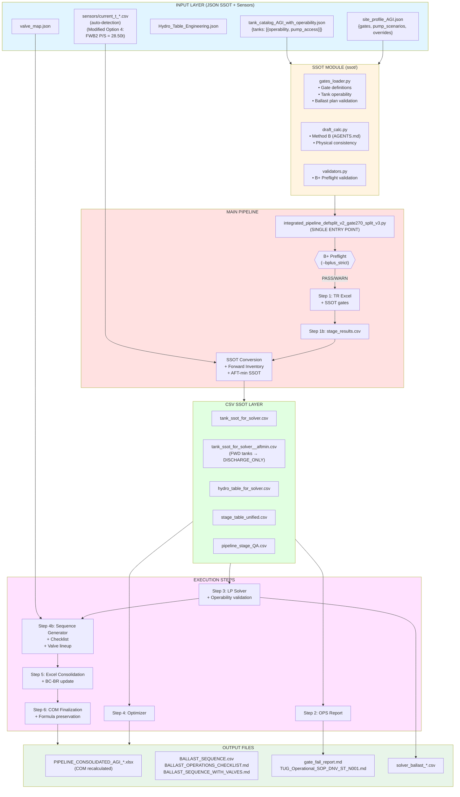

Chapter 1: Pipeline Architecture Overview

**Date:** 2025-12-20
**Version:** v3.8 (Updated: 2025-12-29)
**Purpose:** Understanding the overall structure and design philosophy of the Ballast Pipeline

**Latest Update (v3.8 - 2025-12-29):**

- Added complete pipeline execution file list (21 files, categorized)
- Expanded component interface map (including Step 0, Step 5, post-processing, utilities)
- Classified by execution method (subprocess, import module, dynamic import)
- Specified activation conditions and dependency relationships
- For details, refer to `00_System_Architecture_Complete.md` section 8

**Latest Update (v3.7 - 2025-12-29):**

- Added complete pipeline execution file list (21 files, categorized)
- Classified by execution method (subprocess, import module, dynamic import)
- Specified activation conditions and dependency relationships
- For details, refer to `00_System_Architecture_Complete.md` section 8
- Forecast_Tide_m priority change: CLI `--forecast_tide` value takes highest priority
  - Ensures complete consistency of `Forecast_Tide_m` between `stage_table_unified.csv` and `solver_ballast_summary.csv`
  - For details, refer to `17_TIDE_UKC_Calculation_Logic.md` section 17.6.5

**Latest Update (v3.6 - 2025-12-28):**

- Option 2 implementation complete: Step 4b Ballast Sequence Generator (option/execution separation)
  - `BALLAST_OPTION.csv`: 63 rows (planning level, Delta_t centered, includes all Stages, includes Stage 6B)
  - `BALLAST_EXEC.csv`: 49 steps (execution sequence, Start_t/Target_t carry-forward, excludes Stage 6B)
  - `generate_sequence_with_carryforward()`: Start_t/Target_t carry-forward implementation
  - `generate_option_plan()`: Option plan generation (includes Stage 6B)
  - Excel export: 3 sheets (Sequence_Ballast_Option, Sequence_Ballast_Exec, Sequence_Ballast_Sequence)
  - Verification complete: Stage 6B separation normal, Start_t/Target_t continuity normal
- Option 1 patch proposal (not implemented)
  - Inject Forecast_tide_m into Bryan Pack (merge from pipeline_stage_QA.csv)
  - Force Stage 5_PreBallast as GateB critical (AGI rule)
  - Unify Current_* vs Draft_* (QA table)

**Latest Update (v3.5 - 2025-12-28):**

- Option 2 implementation: BALLAST_SEQUENCE option/execution separation
  - `BALLAST_OPTION.csv`: Planning level (Delta_t centered, includes all Stages)
  - `BALLAST_EXEC.csv`: Execution sequence (Start_t/Target_t carry-forward, excludes Stage 6B)
  - `generate_sequence_with_carryforward()`: Start_t/Target_t chain implementation
  - `generate_option_plan()`: Option plan generation (includes Priority, Rationale)
  - Added "Ballast_Option" and "Ballast_Exec" sheets to Excel export

**Latest Update (v3.4 - 2025-12-28):**

- I/O Optimization (PR-01~05): Performance improvement stack added
  - Manifest logging (subprocess-safe JSONL)
  - Parquet sidecar cache (mtime validation)
  - Fast CSV reading (Polars lazy scan)
  - Unified read_table_any() API
- MAMMOET Calculation Sheet Generator: `create_mammoet_calculation_sheet.py`
  - Automatic generation of MAMMOET-style technical calculation documents
  - Word document format (python-docx)

**Latest Update (v3.3 - 2025-12-27):**

- Added `tide/tide_ukc_engine.py` SSOT engine documentation
- Added detailed file list for `tide/` and `spmt/` directories in directory structure
- Documented Tide Integration Option B Hybrid

**Previous Update (v3.2 - 2025-12-27):**

- SSOT Stage definition integration (AGI-only, stage_results.csv SSOT enforcement)
- Improved Preballast fallback (uses preballast_min_t)
- FR_PREBALLAST safety (changed to 22.0)

**Latest Update (v3.1 - 2025-12-27):**

- Current_t auto-detection feature (automatic detection of current_t_*.csv pattern)
- diff_audit.csv generation (sensor injection history recording)
- GM verification v2b (CLAMP detection, FSM status check)
- GM Grid axis alignment (DISP×TRIM standardization)

**Latest Update (v3.0 - 2025-12-25):**

- SSOT Phase 1 integration (ssot/ module - gates_loader, draft_calc, validators)
- B-1 Critical Patches (Pump capability 10t/h, Tank operability VOID3)
- P0/P1 Phase completion (Sequence generator, B+ Preflight, Hold point, Valve lineup)
- Modified Option 4 strategy (Forward Inventory: FWB2 28.50t/side)
- Excel Formula Preservation (COM post-processing)
- Added Step 4b (Ballast Sequence Generation)

---

## 1.1 System Overview

### 1.1.1 Purpose

Ballast Pipeline (Definition-split v2 + SSOT v3) is an integrated pipeline for automating and optimizing **Ballast Management** operations for vessels. It specifically addresses the following core issues:

- **SSOT (Single Source of Truth)**: Single source integration of Gate definitions, Tank catalog, Site profiles
- **Definition Split**: Prevention of confusion between tide forecast (Forecast Tide) and required water level (Required WL)
- **Gate Unified System**: Gate system that simultaneously enforces FWD maximum and AFT minimum values
- **Optimization**: Linear Programming-based Ballast plan optimization
- **Automation**: Sequential execution of 6 independent steps to form a complete workflow
- **Operations Ready**: Automatic generation of Ballast sequence, Hold point, Valve lineup

### 1.1.2 Key Features

- **AGI-Specific**: AGI site-specific pipeline (parameters managed via profile JSON)
- **Definition-Split Enforcement**: Clear separation of Draft, Freeboard, UKC
- **SSOT Integration**: JSON Schema-based validation, single source of truth principle
- **Iterative Hydro Updates**: Re-interpolation of Hydrostatic Table based on draft changes
- **Forward Inventory Strategy**: AFT draft control through pre-fill/discharge strategy
- **B+ Preflight Validation**: Input/Physics/Gate/SSOT integrity validation
- **Hold Point Management**: Recalculation and Go/No-Go decisions based on real-time measurements
- **Valve Lineup Detail**: Automatic generation of step-by-step valve operation procedures
- **Excel Formula Preservation**: Guaranteed formula recalculation via COM
- **I/O Optimization (PR-01~05)**: Polars lazy scan, Parquet cache, Manifest logging
- **MAMMOET Calculation Sheet**: Technical calculation document generator

---

## 1.2 Architecture Components

### 1.2.1 Main Pipeline Orchestrator (Single Entry Point)

**File:** `integrated_pipeline_defsplit_v2_gate270_split_v3.py`

- Role: Main script that sequentially executes the entire workflow (**SINGLE ENTRY POINT**)
- Key Features:
  - Sequential execution of 6 steps (Step 1 → 1b → SSOT Prep → 2 → 3 → 4 → 4b → Excel Finalization)
  - Site profile loading and SSOT parameter application
  - B+ Preflight validation (`--bplus_strict` flag)
  - Input data conversion (JSON → CSV SSOT)
  - Forward Inventory strategy application (AFT-min stages)
  - Ballast sequence and checklist generation
  - Valve lineup integration
  - Excel COM post-processing
  - Collection and validation of intermediate outputs
  - Log management and error handling
  - Current_t sensor data auto-detection and injection
    - `resolve_current_t_sensor_csv()`: Auto-detection (current_t_*.csv pattern)
    - `inject_current_t_from_sensor_csv()`: Injection and diff_audit.csv generation
  - GM verification integration
    - `verify_gm_stability_v2b.py`: CLAMP detection, FSM verification, GM_eff calculation
  - I/O optimization integration (PR-01~05)
    - Run ID-based manifest directory creation
    - Environment variable injection (PIPELINE_RUN_ID, PIPELINE_MANIFEST_DIR, PIPELINE_STEP)
    - Parquet sidecar cache creation immediately after Step 1b (`write_parquet_sidecar()`)
    - Use of `read_table_any()` at all CSV read points (Parquet priority, CSV fallback)

##1.2.2 SSOT Module (Phase 1)

**Directory:** `ssot/`

#### gates_loader.py

- Site profile loading and validation
- Gate definitions management (`AFT_MIN_2p70_propulsion`, `FWD_MAX_2p70_critical_only`)
- Tank catalog loading and operability validation
- Ballast plan validation (VOID3 constraints, pump access)

#### draft_calc.py

- AGENTS.md Method B implementation
- Physical consistency guarantee based on LCF/LBP
- Draft calculation based on trim

#### validators.py (P1-1 B+ Preflight)

- **InputValidator**: Input data integrity validation
- **PhysicsValidator**: Physical consistency validation (displacement, trim)
- **GatePreflightValidator**: Gate feasibility pre-validation
- **SSOTVersionValidator**: SSOT profile version compatibility validation

### 1.2.3 I/O Optimization Module (PR-01~05)

**Directory:** Root (`01_EXECUTION_FILES/`)

#### perf_manifest.py (PR-01)

- Subprocess-safe JSONL manifest logging
- Run ID-based manifest file generation (`manifests/<run_id>/<step>_<pid>.jsonl`)
- Automatic I/O operation tracking (file path, size, engine, cache hit/miss)
- Environment variable-based path determination (`PIPELINE_RUN_ID`, `PIPELINE_MANIFEST_DIR`)

#### io_detect.py (PR-02)

- 1-pass encoding detection (BOM-first, charset_normalizer fallback)
- Automatic delimiter inference (sample line-based)
- Replaces `_try_read_csv_flexible()`

#### io_csv_fast.py (PR-03)

- Polars lazy scan priority (projection pushdown)
- pandas fallback (pyarrow → c → python)
- Manifest logging integration

#### io_parquet_cache.py (PR-04, PR-05)

- Parquet sidecar cache creation (`write_parquet_sidecar()`)
- mtime-based cache validation (CSV and Parquet mtime comparison)
- Unified `read_table_any()` API:
  1. Parquet priority load (mtime validation)
  2. CSV fast-path fallback (Polars → pandas)
  3. Automatic manifest logging

**Integration Points:**

- Orchestrator: Parquet cache creation immediately after Step 1b, Sensor CSV read
- OPS: `df_stage_ssot` load (`read_table_any()`)
- StageExcel: `_load_stage_rows_from_stage_results()` (`read_table_any()`)

**Performance Improvements:**

- Parquet read: 3-5x faster than CSV read
- Cache hit: 10x+ faster on second execution
- Manifest logging: <1ms overhead

### 1.2.4 Core Execution Scripts

#### Step 1: TR Excel Generator

**File:** `agi_tr_patched_v6_6_defsplit_v1.py`

- Role: TR (Technical Report) Excel file generation
- SSOT Integration: Loads gate limits via `load_ssot_gates()`
- Input:
  - `Hydro_Table_Engineering.json`
  - `GM_Min_Curve.json`, `Acceptance_Criteria.json`
  - `Securing_Input.json`
  - `bplus_inputs/data/GZ_Curve_*.json` (10 files)
- Output:
  - `LCT_BUSHRA_AGI_TR_Final_v6_2.xlsx`
  - `stage_results.csv` (when executed in CSV mode)

#### Step 2: OPS Integrated Report

**File:** `ops_final_r3_integrated_defs_split_v4.py`

- Role: Operational stage-wise integrated report generation (Excel + Markdown)
- Input:
  - `tank_catalog_from_tankmd.json`
  - `stage_results.csv`
  - Hydrostatic tables
- Output:
  - `OPS_FINAL_R3_AGI_Ballast_Integrated.xlsx`
  - `OPS_FINAL_R3_Report_Integrated.md`

#### Step 3: Ballast Gate Solver (LP)

**File:** `ballast_gate_solver_v4.py`

- Role: Linear Programming-based Ballast plan optimization
- SSOT Integration: Loads gate/pump/tank parameters via `load_agi_profile()`
- B-1 Patches:
  - Pump scenario enforcement (ship 10t/h + hired 100t/h)
  - Tank operability validation (VOID3 pre-ballast only)
  - `DISCHARGE_ONLY` bound enforcement
- Input:
  - `tank_ssot_for_solver.csv` (or `tank_ssot_for_solver__aftmin.csv`)
  - `hydro_table_for_solver.csv`
  - `stage_table_unified.csv`
- Output:
  - `solver_ballast_plan.csv`
  - `solver_ballast_summary.csv`
  - `solver_ballast_stage_plan.csv`

#### Step 4: Ballast Optimizer

**File:** `Untitled-2_patched_defsplit_v1_1.py`

- Role: Optimization combining operational heuristics and LP
- Input: Same as Step 3
- Output:
  - `optimizer_ballast_plan.xlsx`
  - `optimizer_summary.csv`

#### Step 4b: Ballast Sequence Generator (P0-2, Option 2)

**Module:** `ballast_sequence_generator.py`, `checklist_generator.py`

- Role: Step-by-step operational procedure generation
- Features:
  - Pump rate-based time calculation
  - Daylight window enforcement
  - Hold point definition
  - Contingency scenario integration (Condition A/B/C)
  - **Start_t/Target_t carry-forward**: Automatic transfer of previous step's Target_t → next Start_t
  - **Stage 6B separation**: Optional Stages excluded from execution sequence
- Output:
  - `BALLAST_OPTION.csv`: Planning level (Delta_t centered, includes all Stages)
  - `BALLAST_EXEC.csv`: Execution sequence (Start_t/Target_t chain, excludes Stage 6B)
  - `BALLAST_SEQUENCE.csv`: Legacy (compatibility)
  - `BALLAST_SEQUENCE.xlsx`: Excel (Option + Exec sheets)
  - `BALLAST_OPERATIONS_CHECKLIST.md`
  - `BALLAST_SEQUENCE_WITH_VALVES.md` (P1-3)

**Core Logic (Option 2):**

```python
# Tank state tracking across steps (carry-forward)
tank_state: Dict[str, float] = initial_tank_current.copy()

# Start_t = current tank state (carry-forward from previous step)
start_t = tank_state.get(tank_id, 0.0)

# Update tank state for next step
tank_state[tank_id] = target_t
```

**Stage 6B Separation:**

- `OPTIONAL_STAGES = ["Stage 6B Tide Window"]` constant definition
- Excluded from execution sequence via `exclude_optional_stages=True` parameter
- Optional sequence generated separately via `generate_optional_sequence()` function

#### Step 5: Valve Lineup Generator (P1-3)

**Module:** `valve_lineup_generator.py`

- Role: Detailed valve operation procedure generation
- Input: `valve_map.json`, `BALLAST_SEQUENCE.csv`
- Output: `BALLAST_SEQUENCE_WITH_VALVES.md`

#### Step 6: Excel Formula Preservation

**Script:** `ballast_excel_finalize.py`

- Role: COM-based Excel formula recalculation
- Process:
  - Calculation mode → Automatic
  - RefreshAll() → External data update
  - CalculateFullRebuild() → Dependency graph reconstruction
  - Audit trail recording in Calc_Log sheet
- Output: `PIPELINE_CONSOLIDATED_AGI_*.xlsx` (final)

### 1.2.7 Complete Pipeline Execution File List (v3.7 New)

**Latest Verification Date**: 2025-12-29
**Total Execution Files**: 21 (excluding duplicates, including modules)

#### Required Execution Files (Main Pipeline Steps)

| Step              | Script File Name                                             | Default Path                                                 | Execution Method | Description                                           |
| ----------------- | ------------------------------------------------------------ | ------------------------------------------------------------ | ---------------- | ----------------------------------------------------- |
| **Step 0**  | `agi_spmt_unified.py`                                      | `spmt v1/agi_spmt_unified.py`                              | `subprocess`   | SPMT cargo input generation (optional)                |
| **Step 1**  | `agi_tr_patched_v6_6_defsplit_v1.py`                       | `agi_tr_patched_v6_6_defsplit_v1.py`                       | `subprocess`   | TR Excel generation (optional)                        |
| **Step 1b** | `agi_tr_patched_v6_6_defsplit_v1.py`                       | Same                                                         | `subprocess`   | `stage_results.csv` generation (required, csv mode) |
| **Step 2**  | `ops_final_r3_integrated_defs_split_v4_patched_TIDE_v1.py` | `ops_final_r3_integrated_defs_split_v4_patched_TIDE_v1.py` | `subprocess`   | OPS Integrated report (Excel + MD)                    |
| **Step 3**  | `ballast_gate_solver_v4_TIDE_v1.py`                        | `tide/ballast_gate_solver_v4_TIDE_v1.py`                   | `subprocess`   | Ballast Gate Solver (LP)                              |
| **Step 4**  | `Untitled-2_patched_defsplit_v1_1.py`                      | `Untitled-2_patched_defsplit_v1_1.py`                      | `subprocess`   | Ballast Optimizer (optional)                          |
| **Step 5**  | `bryan_template_unified_TIDE_v1.py`                        | `tide/bryan_template_unified_TIDE_v1.py`                   | `subprocess`   | Bryan Template generation and population              |

#### Optional Execution Files (Optional Steps)

| Step              | Script File Name                  | Default Path                      | Execution Method    | Activation Condition      |
| ----------------- | --------------------------------- | --------------------------------- | ------------------- | ------------------------- |
| **Step 4b** | `ballast_sequence_generator.py` | `ballast_sequence_generator.py` | `import` (module) | `--enable-sequence`     |
| **Step 4b** | `checklist_generator.py`        | `checklist_generator.py`        | `import` (module) | `--enable-sequence`     |
| **Step 4c** | `valve_lineup_generator.py`     | `valve_lineup_generator.py`     | `import` (module) | `--enable-valve-lineup` |

#### Dependent Execution Files (Dependencies)

| Parent Script                         | Dependent Script                       | Default Path                           | Execution Method      | Description                               |
| ------------------------------------- | -------------------------------------- | -------------------------------------- | --------------------- | ----------------------------------------- |
| `bryan_template_unified_TIDE_v1.py` | `create_bryan_excel_template_NEW.py` | `create_bryan_excel_template_NEW.py` | `subprocess`        | Bryan Template generation (inside Step 5) |
| `bryan_template_unified_TIDE_v1.py` | `populate_template.py`               | `populate_template.py`               | `import` (embedded) | Template population logic (inside Step 5) |

#### Post-Processing Execution Files (Post-Processing)

| Script File Name              | Default Path                       | Execution Method | Activation Condition                                      | Description                       |
| ----------------------------- | ---------------------------------- | ---------------- | --------------------------------------------------------- | --------------------------------- |
| `excel_com_recalc_save.py`  | `tide/excel_com_recalc_save.py`  | `subprocess`   | When `EXCEL_COM_RECALC_OUT` environment variable is set | Excel formula recalculation (COM) |
| `ballast_excel_finalize.py` | `tide/ballast_excel_finalize.py` | `subprocess`   | Auto-executes when file exists                            | Excel formula finalization        |

#### Utility Execution Files (Utilities)

| Script File Name                | Default Path                    | Execution Method     | Activation Condition                              | Description                                           |
| ------------------------------- | ------------------------------- | -------------------- | ------------------------------------------------- | ----------------------------------------------------- |
| `compile_headers_registry.py` | `compile_headers_registry.py` | `import` (dynamic) | Auto-executes when `HEADERS_MASTER.xlsx` exists | Compiles HEADERS_MASTER.xlsx → headers_registry.json |
| `debug_report.py`             | `debug_report.py`             | `import` (dynamic) | `--debug_report` or `--auto_debug_report`     | Debug report generation (optional)                    |

#### Module Dependencies (Module Dependencies)

| Module Path                     | Usage Location  | Execution Method | Description                                             |
| ------------------------------- | --------------- | ---------------- | ------------------------------------------------------- |
| `ssot.gates_loader`           | Step 4b         | `import`       | `SiteProfile`, `load_agi_profile` (profile loading) |
| `ssot.data_quality_validator` | Step 3, Step 4b | `import`       | `DataQualityValidator` (Tidying First Implementation) |
| `tide.tide_ukc_engine`        | Multiple Steps  | `import`       | Tide/UKC calculation SSOT engine                        |
| `tide.tide_constants`         | Multiple Steps  | `import`       | Tide/UKC constants                                      |

#### Pre-Step Execution Files (Optional)

| Script File Name         | Default Path             | Execution Method            | Activation Condition                | Description                        |
| ------------------------ | ------------------------ | --------------------------- | ----------------------------------- | ---------------------------------- |
| `tide_stage_mapper.py` | `tide_stage_mapper.py` | Manual execution (Pre-Step) | When `--tide_windows` is provided | Stage-wise tide mapping (AGI-only) |

#### Execution File Statistics

| Category                                           | Count        | Notes                                      |
| -------------------------------------------------- | ------------ | ------------------------------------------ |
| **Required execution files (subprocess)**    | 4            | Step 1b, Step 2, Step 3 (always executed)  |
| **Optional execution files (subprocess)**    | 3            | Step 0, Step 1, Step 4, Step 5             |
| **Optional execution files (import module)** | 3            | Step 4b, Step 4c                           |
| **Dependent execution files**                | 2            | Internal Bryan Template calls              |
| **Post-processing execution files**          | 2            | Excel finalization                         |
| **Utility execution files**                  | 2            | Headers registry compilation, Debug report |
| **Module dependencies**                      | 4            | SSOT modules (import)                      |
| **Pre-Step execution files**                 | 1            | Tide mapping (manual execution)            |
| **Total**                                    | **21** | (excluding duplicates, including modules)  |

**Notes**:

- All execution files are called from `integrated_pipeline_defsplit_v2_gate270_split_v3_auditpatched_autodetect_TIDE_v1.py` via `step_run_script()`, `subprocess.run()`, or dynamic `import`.
- Script paths are auto-detected via `resolve_script_path()` function (scripts in parent folders are auto-recognized even when executed from `tide/` directory).
- For detailed architecture, refer to `00_System_Architecture_Complete.md` section 8.

### 1.2.5 MAMMOET Calculation Sheet Generator

**File:** `create_mammoet_calculation_sheet.py`

- Role: Automatic generation of MAMMOET-style technical calculation documents
- Format: Word document (.docx, python-docx)
- Features:
  - Header: Company name (red) + "Calculation Sheet" (gray)
  - Project information table (2 columns: Project Details / Preparation Details)
  - Sections: INTRODUCTION, MOTION CRITERIA, FORCES EX-SHIPS MOTION, ILLUSTRATION
  - Signature section: Prepared by / Checked by / Approved by
- Usage Example:
  ```python
  from create_mammoet_calculation_sheet import create_mammoet_calculation_sheet
  create_mammoet_calculation_sheet(
      output_path=Path("calculation_sheet.docx"),
      project_data={...},
      prep_data={...},
      motion_data={...},
      forces_data={...},
  )
  ```

### 1.2.6 P1 Phase Additional Features

#### Hold Point Recalculator (P1-2)

**Module:** `hold_point_recalculator.py`, `hold_point_cli.py`

- Role: Recalculation based on real-time measurements
- Features:
  - Measured draft/trim → Displacement estimation
  - Tank current_t reverse calculation
  - Remaining steps re-optimization
  - Go/No-Go decision
- CLI: Field measurement input interface

#### GM & Stability Verification (v2b)

**Module:** `verify_gm_stability_v2b.py`

- Role: GM and stability verification (CLAMP detection, FSM verification)
- Features:
  - GM 2D Grid bilinear interpolation (DISP×TRIM)
  - CLAMP range detection (VERIFY_CLAMP_RANGE)
  - FSM coefficient validation (VERIFY_FSM_MISSING)
  - GM_eff calculation (GM_raw - FSM/Displacement)
- Input:
  - `pipeline_stage_QA.csv`
  - `tank_ssot_for_solver.csv`
  - `LCT_BUSHRA_GM_2D_Grid.json` (optional)
  - `Tank_FSM_Coeff.json` (optional)
- Output:
  - `gm_stability_verification_v2b.csv`
  - CLAMP summary report

---

## 1.3 Data Flow Architecture



---

## 1.4 Core Design Principles

### 1.4.1 SSOT (Single Source of Truth)

Each data source is **defined once in JSON format**, and the pipeline converts to **CSV as needed**. This ensures:

- Data consistency guarantee
- Script compatibility
- Easy version management

### 1.4.2 Definition-Split

The following concepts are **clearly separated** to prevent confusion:

- **Forecast_Tide_m**: Tide forecast (predicted tide height above Chart Datum)
- **Required_WL_for_UKC_m**: Required water level for UKC satisfaction (reverse-calculated)
- **Freeboard**: D_vessel_m - Draft (tide-independent)
- **UKC**: (DepthRef + Forecast_Tide) - (Draft_ref + Squat + Safety)

### 1.4.3 Gate Unified System

Multiple constraints are **enforced simultaneously**:

- **FWD_MAX**: FWD ≤ 2.70m (Port/Ramp gate)
- **AFT_MIN**: AFT ≥ 2.70m (Captain/Prop immersion gate)
- **Freeboard ≥ 0**: Deck clearance
- **UKC ≥ UKC_MIN**: Under-keel clearance (if provided)

#### 2.70m Split Gates (v2.1+)

The pipeline reports 2.70m gates separately in `gate_fail_report.md`:

- **Gate-A (Captain)**: AFT draft ≥ 2.70m (ensures propeller effectiveness in emergency)
- **Gate-B (Mammoet, critical RoRo stages)**: FWD draft ≤ 2.70m (Chart Datum basis)

**Application Scope:**

- Gate-A: Applied to all Stages
- Gate-B: Applied only to Critical stages (regex: `CRITICAL|6A|RORO|RAMP|ROLL|LOADOUT`)

**Implementation Details (v2.1 patch):**

- `add_split_270_gates()` function adds new gate columns to Stage QA DataFrame
- Creates `GateA_AFT_MIN_2p70_PASS`, `GateA_AFT_MIN_2p70_Margin_m` columns
- Creates `GateB_FWD_MAX_2p70_CD_PASS`, `GateB_FWD_MAX_2p70_CD_Margin_m`, `GateB_FWD_MAX_2p70_CD_applicable` columns
- Includes separate PASS/FAIL aggregation in report

### 1.4.4 Iterative Refinement

LP Solver improves accuracy through **Hydrostatic Table re-interpolation**:

1. Interpolate Hydro Point with initial Tmean
2. Perform LP optimization
3. Re-interpolate with predicted new Tmean
4. Repeat until convergence (default 2 iterations)

---

## 1.5 Directory Structure

```
ballast_pipeline_defsplit_v2_complete/
├── integrated_pipeline_defsplit_v2_gate270_split_v3.py  # Main pipeline (SINGLE ENTRY POINT)
├── agi_tr_patched_v6_6_defsplit_v1.py      # Step 1
├── ops_final_r3_integrated_defs_split_v4.py # Step 2
├── ballast_gate_solver_v4.py               # Step 3
├── Untitled-2_patched_defsplit_v1_1.py     # Step 4
│
├── ssot/                                    # SSOT Module (Phase 1)
│   ├── __init__.py
│   ├── gates_loader.py                     # Gate/Tank SSOT
│   ├── draft_calc.py                       # Method B calculations
│   ├── validators.py                       # B+ Preflight (P1-1)
│   └── profiles/
│       └── AGI.json                        # Site profile
│
├── ballast_sequence_generator.py           # Step 4b (P0-2)
├── checklist_generator.py                  # Checklist generator
├── valve_lineup_generator.py               # Valve lineup (P1-3)
├── hold_point_recalculator.py              # Hold point tool (P1-2)
├── hold_point_cli.py                       # Field CLI (P1-2)
├── ballast_excel_finalize.py               # Excel COM post-processing
├── verify_gm_stability_v2b.py              # GM verification (v2b)
├── build_gm_grid_json_v2.py               # GM Grid generation (DISP×TRIM)
├── convert_fsm_knm_to_tm.py                # FSM coefficient conversion (kN·m → t·m)
├── summarize_clamp_report.py               # CLAMP summary report
│
├── sensors/
│   └── current_t_*.csv                     # Current_t sensor data (auto-detection)
│
├── tide/                                    # Tide Integration (AGI-only)
│   └── tide_ukc_engine.py                  # SSOT engine for Tide/UKC calculations
│
├── spmt/                                    # SPMT Integration scripts
│   ├── cargo_spmt_inputs_stagewise_autofill.py
│   ├── lct_stage_spmt_shuttle_ssot_patched.py  # SSOT-patched version
│   ├── lct_stage_spmt_shuttle.py          # Legacy
│   ├── spmt_shuttle_stage_builder.py
│   ├── spmt.1.py
│   ├── spmt2_ssot_patched.py               # SSOT-patched version
│   ├── spmt2.py                            # Legacy
│   ├── stage_shuttle_autocalc.py
│   └── stage_shuttle_autocalc1.py
│
├── patch1225/                              # SSOT definitions
│   ├── tank_catalog_AGI_with_operability.json
│   ├── AGI_site_profile_COMPLETE_v1.json
│   ├── gate_ssot_schema_v1.json
│   ├── tank_catalog_schema_v1.json
│   ├── ballast_sequence_schema_v1.json
│   └── valve_map.json
│
├── bplus_inputs/                           # Input data
│   ├── Hydro_Table_Engineering.json
│   ├── LCT_BUSHRA_GM_2D_Grid.json         # GM 2D Grid (DISP×TRIM)
│   ├── Tank_FSM_Coeff.json                 # FSM coefficients (t·m)
│   └── data/
│       └── GZ_Curve_Stage_*.json (10 files)
│
├── *.json                                  # Other input JSON
│   ├── tank_catalog_from_tankmd.json
│   ├── GM_Min_Curve.json
│   ├── Acceptance_Criteria.json
│   └── ...
│
├── final_output_<timestamp>/               # Execution output
│   ├── ssot/                               # SSOT CSV files
│   │   ├── tank_ssot_for_solver.csv
│   │   ├── tank_ssot_for_solver__aftmin.csv  # AFT-min stages
│   │   ├── hydro_table_for_solver.csv
│   │   ├── stage_table_unified.csv
│   │   ├── pipeline_stage_QA.csv
│   │   └── diff_audit.csv                  # Current_t injection history
│   ├── BALLAST_OPTION.csv          # Option plan (all Stages)
│   ├── BALLAST_EXEC.csv            # Execution sequence (excludes Stage 6B)
│   ├── BALLAST_SEQUENCE.csv        # Legacy (compatibility)
│   ├── BALLAST_SEQUENCE.xlsx       # Excel (Option + Exec sheets)
│   ├── BALLAST_OPERATIONS_CHECKLIST.md
│   ├── BALLAST_SEQUENCE_WITH_VALVES.md
│   ├── gate_fail_report.md
│   ├── TUG_Operational_SOP_DNV_ST_N001.md
│   ├── PIPELINE_CONSOLIDATED_AGI_*.xlsx    # Final (COM recalculated)
│   └── *.xlsx, *.csv, *.md
│
├── FINAL_DELIVERY_20251225/                # Production package
│   ├── 01_EXECUTION_FILES/
│   ├── 02_INPUT_CONFIGURATIONS/
│   ├── 03_OUTPUT_RESULTS/
│   ├── 04_REPORTS/
│   └── README.md
│
└── docs/                                   # Documentation
    ├── 00_System_Architecture_Complete.md
    ├── 01_Architecture_Overview.md
    ├── 03_Pipeline_Execution_Flow.md
    ├── 07_AFT_Draft_Analysis_and_Forward_Inventory_Strategy.md
    ├── 14_Modified_Option4_Complete_Guide.md
    ├── 15_Final_Delivery_Package_Guide.md
    ├── P1_IMPLEMENTATION_CHECKLIST.md
    ├── B1_OPERABILITY_IMPLEMENTATION_REPORT.md
    └── ...
```

---

## 1.6 Execution Modes and Options

### 1.6.1 Basic Execution (Production)

```bash
python integrated_pipeline_defsplit_v2_gate270_split_v3.py \
  --site AGI \
  --profile_json site_profile_AGI_aft_ballast_EXACT_ONLY.json \
  --exclude_fwd_tanks_aftmin_only \
  --hmax_wave_m 0.30 \
  --four_corner_monitoring \
  --bplus_strict \
  --forecast_tide 0.70 \
  --depth_ref 5.50 \
  --ukc_min 0.50
```

### 1.6.2 Forward Inventory Strategy Execution (Modified Option 4)

```bash
# After setting FWB2 P/S = 28.50t in sensors/current_t_sensor.csv, execute
python integrated_pipeline_defsplit_v2_gate270_split_v3.py \
  --site AGI \
  --exclude_fwd_tanks_aftmin_only \
  --bplus_strict
```

### 1.6.3 B+ Preflight Validation (P1-1)

```bash
# Strict mode: Outputs warnings on validation failure and continues execution
python integrated_pipeline_defsplit_v2_gate270_split_v3.py --bplus_strict

# Validation items:
# - Input validation: Current_t, Min_t, Max_t range validation
# - Physics validation: Displacement, Trim consistency
# - Gate preflight: Feasibility pre-validation
# - SSOT version: Profile version compatibility
```

### 1.6.4 Hold Point Recalculation (P1-2)

```bash
# Field CLI execution
python hold_point_cli.py

# Interactive input:
# - Stage name
# - Measured FWD/AFT draft
# - Timestamp
# → Go/No-Go decision + recalculation
```

### 1.6.5 Step-by-Step Execution Control

```bash
# Execute only Step 1~3 (exclude Optimizer)
python integrated_pipeline_defsplit_v2_gate270_split_v3.py --to_step 3

# Execute from Step 2 (skip Step 1)
python integrated_pipeline_defsplit_v2_gate270_split_v3.py --from_step 2
```

---

## 1.7 Option 1 Patch Proposal (AGI Submission Feasibility Improvement, Not Implemented)

### Background

AGI submission feasibility verification results indicate that the following 3 patches are needed:

1. **Bryan Pack Forecast_tide_m Injection**

   - Issue: `Forecast_tide_m` not injected in `07_Stage_Calc` of `Bryan_Submission_Data_Pack_Populated.xlsx`
   - Solution: Read `Forecast_tide_m` from `pipeline_stage_QA.csv`, merge into `stage_results.csv`, then populate
   - Implementation location: `integrated_pipeline` Step 5 (before Bryan Pack generation)
2. **Stage 5_PreBallast GateB Critical Enforcement**

   - Issue: `Stage 5_PreBallast` is not caught as GateB critical application target
   - Solution: Add explicit check to `_is_critical_stage()` function
   - Implementation location: `integrated_pipeline` Gate calculation logic
3. **Current_* vs Draft_* Unification**

   - Issue: Both `Current_*` and `Draft_*` exist simultaneously in `pipeline_stage_QA.csv`, causing confusion
   - Solution: Remove `Current_*` columns or unify to `Draft_*` during QA generation
   - Implementation location: `generate_stage_QA_csv()` function

**Details:** Refer to `02_IMPLEMENTATION_REPORTS/20251228/OPTION1_OPTION2_AGI_SUBMISSION_PATCHES_20251228.md`

---

## 1.8 Pipeline Execution File List

**Latest Verification Date**: 2025-12-29
**Total Execution Files**: 21 (excluding duplicates, including modules)

### 1.8.1 Required Execution Files (Main Pipeline Steps)

| Step              | Script File Name                                             | Default Path                                                 | Execution Method | Description                                           |
| ----------------- | ------------------------------------------------------------ | ------------------------------------------------------------ | ---------------- | ----------------------------------------------------- |
| **Step 0**  | `agi_spmt_unified.py`                                      | `spmt v1/agi_spmt_unified.py`                              | `subprocess`   | SPMT cargo input generation (optional)                |
| **Step 1**  | `agi_tr_patched_v6_6_defsplit_v1.py`                       | `agi_tr_patched_v6_6_defsplit_v1.py`                       | `subprocess`   | TR Excel generation (optional)                        |
| **Step 1b** | `agi_tr_patched_v6_6_defsplit_v1.py`                       | Same                                                         | `subprocess`   | `stage_results.csv` generation (required, csv mode) |
| **Step 2**  | `ops_final_r3_integrated_defs_split_v4_patched_TIDE_v1.py` | `ops_final_r3_integrated_defs_split_v4_patched_TIDE_v1.py` | `subprocess`   | OPS Integrated report (Excel + MD)                    |
| **Step 3**  | `ballast_gate_solver_v4_TIDE_v1.py`                        | `tide/ballast_gate_solver_v4_TIDE_v1.py`                   | `subprocess`   | Ballast Gate Solver (LP)                              |
| **Step 4**  | `Untitled-2_patched_defsplit_v1_1.py`                      | `Untitled-2_patched_defsplit_v1_1.py`                      | `subprocess`   | Ballast Optimizer (optional)                          |
| **Step 5**  | `bryan_template_unified_TIDE_v1.py`                        | `tide/bryan_template_unified_TIDE_v1.py`                   | `subprocess`   | Bryan Template generation and population              |

### 1.8.2 Optional Execution Files (Optional Steps)

| Step              | Script File Name                  | Default Path                      | Execution Method    | Activation Condition      |
| ----------------- | --------------------------------- | --------------------------------- | ------------------- | ------------------------- |
| **Step 4b** | `ballast_sequence_generator.py` | `ballast_sequence_generator.py` | `import` (module) | `--enable-sequence`     |
| **Step 4b** | `checklist_generator.py`        | `checklist_generator.py`        | `import` (module) | `--enable-sequence`     |
| **Step 4c** | `valve_lineup_generator.py`     | `valve_lineup_generator.py`     | `import` (module) | `--enable-valve-lineup` |

### 1.8.3 Dependent Execution Files (Dependencies)

| Parent Script                         | Dependent Script                       | Default Path                           | Execution Method      | Description                               |
| ------------------------------------- | -------------------------------------- | -------------------------------------- | --------------------- | ----------------------------------------- |
| `bryan_template_unified_TIDE_v1.py` | `create_bryan_excel_template_NEW.py` | `create_bryan_excel_template_NEW.py` | `subprocess`        | Bryan Template generation (inside Step 5) |
| `bryan_template_unified_TIDE_v1.py` | `populate_template.py`               | `populate_template.py`               | `import` (embedded) | Template population logic (inside Step 5) |

### 1.8.4 Post-Processing Execution Files (Post-Processing)

| Script File Name              | Default Path                       | Execution Method | Activation Condition                                      | Description                       |
| ----------------------------- | ---------------------------------- | ---------------- | --------------------------------------------------------- | --------------------------------- |
| `excel_com_recalc_save.py`  | `tide/excel_com_recalc_save.py`  | `subprocess`   | When `EXCEL_COM_RECALC_OUT` environment variable is set | Excel formula recalculation (COM) |
| `ballast_excel_finalize.py` | `tide/ballast_excel_finalize.py` | `subprocess`   | Auto-executes when file exists                            | Excel formula finalization        |

### 1.8.5 Utility Execution Files (Utilities)

| Script File Name                | Default Path                    | Execution Method     | Activation Condition                              | Description                                           |
| ------------------------------- | ------------------------------- | -------------------- | ------------------------------------------------- | ----------------------------------------------------- |
| `compile_headers_registry.py` | `compile_headers_registry.py` | `import` (dynamic) | Auto-executes when `HEADERS_MASTER.xlsx` exists | Compiles HEADERS_MASTER.xlsx → headers_registry.json |
| `debug_report.py`             | `debug_report.py`             | `import` (dynamic) | `--debug_report` or `--auto_debug_report`     | Debug report generation (optional)                    |

### 1.8.6 Module Dependencies (Module Dependencies)

| Module Path                     | Usage Location  | Execution Method | Description                                             |
| ------------------------------- | --------------- | ---------------- | ------------------------------------------------------- |
| `ssot.gates_loader`           | Step 4b         | `import`       | `SiteProfile`, `load_agi_profile` (profile loading) |
| `ssot.data_quality_validator` | Step 3, Step 4b | `import`       | `DataQualityValidator` (Tidying First Implementation) |
| `tide.tide_ukc_engine`        | Multiple Steps  | `import`       | Tide/UKC calculation SSOT engine                        |
| `tide.tide_constants`         | Multiple Steps  | `import`       | Tide/UKC constants                                      |

### 1.8.7 Pre-Step Execution Files (Optional)

| Script File Name         | Default Path             | Execution Method            | Activation Condition                | Description                        |
| ------------------------ | ------------------------ | --------------------------- | ----------------------------------- | ---------------------------------- |
| `tide_stage_mapper.py` | `tide_stage_mapper.py` | Manual execution (Pre-Step) | When `--tide_windows` is provided | Stage-wise tide mapping (AGI-only) |

### 1.8.8 Execution File Statistics

| Category                                           | Count        | Notes                                      |
| -------------------------------------------------- | ------------ | ------------------------------------------ |
| **Required execution files (subprocess)**    | 4            | Step 1b, Step 2, Step 3 (always executed)  |
| **Optional execution files (subprocess)**    | 3            | Step 0, Step 1, Step 4, Step 5             |
| **Optional execution files (import module)** | 3            | Step 4b, Step 4c                           |
| **Dependent execution files**                | 2            | Internal Bryan Template calls              |
| **Post-processing execution files**          | 2            | Excel finalization                         |
| **Utility execution files**                  | 2            | Headers registry compilation, Debug report |
| **Module dependencies**                      | 4            | SSOT modules (import)                      |
| **Pre-Step execution files**                 | 1            | Tide mapping (manual execution)            |
| **Total**                                    | **21** | (excluding duplicates, including modules)  |

### 1.8.9 Execution File → Output File → Header Mapping

**Key Mappings**:

| Execution File                                               | Output File                                   | Main Header Structure                                                    |
| ------------------------------------------------------------ | --------------------------------------------- | ------------------------------------------------------------------------ |
| `agi_spmt_unified.py`                                      | `AGI_SPMT_Shuttle_Output.xlsx`              | Stage_Summary (6), Stage_Loads (6), Stage_Results (8)                    |
| `agi_tr_patched_v6_6_defsplit_v1.py`                       | `LCT_BUSHRA_AGI_TR_Final_v*.xlsx`           | Ballast_Tanks (6), Hydro_Table (12), Hourly_FWD_AFT_Heights (14)         |
| `ops_final_r3_integrated_defs_split_v4_patched_TIDE_v1.py` | `OPS_FINAL_R3_AGI_Ballast_Integrated.xlsx`  | Stage_Calculations (37), Tank_SSOT (11)                                  |
| `ballast_gate_solver_v4_TIDE_v1.py`                        | `solver_ballast_summary.csv`                | 8 Tide columns (TIDE_v1)                                                 |
| `ballast_sequence_generator.py`                            | `BALLAST_EXEC.csv`                          | 17 columns (Stage, Step, Tank, Action, Start_t, Target_t, Delta_t, etc.) |
| `bryan_template_unified_TIDE_v1.py`                        | `Bryan_Submission_Data_Pack_Populated.xlsx` | 07_Stage_Calc (Row 20, 33-35 columns)                                    |

**Notes**:

- All execution files are called from `integrated_pipeline_defsplit_v2_gate270_split_v3_auditpatched_autodetect_TIDE_v1.py` via `step_run_script()`, `subprocess.run()`, or dynamic `import`.
- Script paths are auto-detected via `resolve_script_path()` function (scripts in parent folders are auto-recognized even when executed from `tide/` directory).
- For detailed architecture, refer to `파이프라인 전체 아키텍처, 실행 파일, 로직 상세 설명.MD` section 2.11.

---

## 1.9 Next Chapter Guide

- **Chapter 2**: Data flow and SSOT conversion details
- **Chapter 3**: Step-by-Step execution flow and detailed logic for each step
- **Chapter 4**: LP Solver mathematical model and optimization algorithm
- **Chapter 5**: Definition-Split concepts and Gate system implementation
- **Chapter 6**: Script interfaces and API documentation for each script

---

**Reference Documents:**

- `README.md`: Quick start guide
- `requirements.txt`: Python package dependencies
- 2025-12-16 document: Definition-Split requirements
- `파이프라인 전체 아키텍처, 실행 파일, 로직 상세 설명.MD`: Detailed execution file list (section 2.11)

```

```
