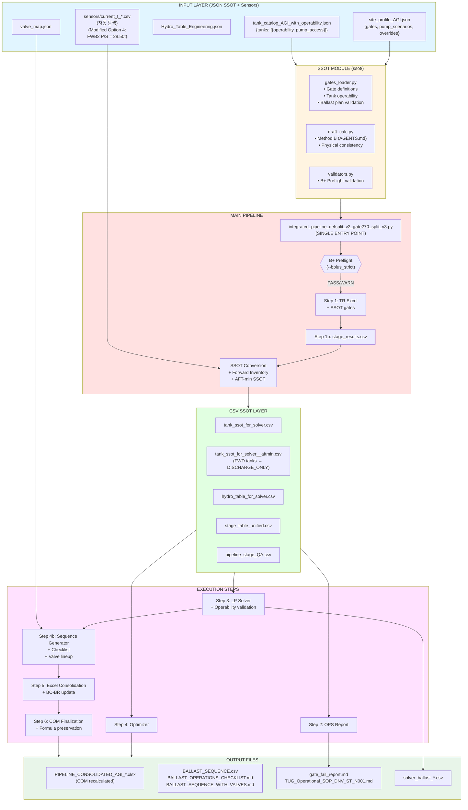

# 제1장: 파이프라인 아키텍처 개요

**작성일:** 2025-12-20
**버전:** v3.8 (Updated: 2025-12-29)
**목적:** Ballast Pipeline의 전체 구조와 설계 철학 이해

**최신 업데이트 (v3.8 - 2025-12-29):**
- 파이프라인 실행 파일 전체 목록 추가 (21개 파일, 카테고리별 분류)
- 컴포넌트 인터페이스 맵 확장 (Step 0, Step 5, 후처리, 유틸리티 포함)
- 실행 방식별 분류 (subprocess, import 모듈, 동적 import)
- 활성화 조건 및 의존성 관계 명시
- 상세 내용: `00_System_Architecture_Complete.md` 섹션 8 참조

**최신 업데이트 (v3.7 - 2025-12-29):**
- 파이프라인 실행 파일 전체 목록 추가 (21개 파일, 카테고리별 분류)
- 실행 방식별 분류 (subprocess, import 모듈, 동적 import)
- 활성화 조건 및 의존성 관계 명시
- 상세 내용: `00_System_Architecture_Complete.md` 섹션 8 참조
- Forecast_Tide_m 우선순위 변경: CLI `--forecast_tide` 값이 최우선 적용
  - `stage_table_unified.csv`와 `solver_ballast_summary.csv` 간 `Forecast_Tide_m` 완전 일치 보장
  - 자세한 내용: `17_TIDE_UKC_Calculation_Logic.md` 섹션 17.6.5 참조

**최신 업데이트 (v3.6 - 2025-12-28):**
- Option 2 구현 완료: Step 4b Ballast Sequence Generator (옵션/실행 분리)
  - `BALLAST_OPTION.csv`: 63 rows (계획 레벨, Delta_t 중심, 모든 Stage 포함, Stage 6B 포함)
  - `BALLAST_EXEC.csv`: 49 steps (실행 시퀀스, Start_t/Target_t carry-forward, Stage 6B 제외)
  - `generate_sequence_with_carryforward()`: Start_t/Target_t carry-forward 구현
  - `generate_option_plan()`: 옵션 계획 생성 (Stage 6B 포함)
  - Excel export: 3개 시트 (Sequence_Ballast_Option, Sequence_Ballast_Exec, Sequence_Ballast_Sequence)
  - 검증 완료: Stage 6B 분리 정상, Start_t/Target_t 연속성 정상
- Option 1 패치 제안 (미구현)
  - Bryan Pack에 Forecast_tide_m 주입 (pipeline_stage_QA.csv에서 병합)
  - Stage 5_PreBallast를 GateB critical로 강제 적용 (AGI 규칙)
  - Current_* vs Draft_* 단일화 (QA 테이블)

**최신 업데이트 (v3.5 - 2025-12-28):**
- Option 2 구현: BALLAST_SEQUENCE 옵션/실행 분리
  - `BALLAST_OPTION.csv`: 계획 레벨 (Delta_t 중심, 모든 Stage 포함)
  - `BALLAST_EXEC.csv`: 실행 시퀀스 (Start_t/Target_t carry-forward, Stage 6B 제외)
  - `generate_sequence_with_carryforward()`: Start_t/Target_t 체인 구현
  - `generate_option_plan()`: 옵션 계획 생성 (Priority, Rationale 포함)
  - Excel export에 "Ballast_Option" 및 "Ballast_Exec" 시트 추가

**최신 업데이트 (v3.4 - 2025-12-28):**
- I/O Optimization (PR-01~05): 성능 개선 스택 추가
  - Manifest logging (subprocess-safe JSONL)
  - Parquet sidecar cache (mtime validation)
  - Fast CSV reading (Polars lazy scan)
  - Unified read_table_any() API
- MAMMOET Calculation Sheet Generator: `create_mammoet_calculation_sheet.py`
  - MAMMOET 스타일 기술 계산서 자동 생성
  - Word 문서 형식 (python-docx)

**최신 업데이트 (v3.3 - 2025-12-27):**
- `tide/tide_ukc_engine.py` SSOT 엔진 문서화 추가
- 디렉토리 구조에 `tide/` 및 `spmt/` 파일 목록 상세 추가
- Tide Integration Option B Hybrid 문서화

**이전 업데이트 (v3.2 - 2025-12-27):**
- SSOT Stage 정의 통합 (AGI 전용, stage_results.csv SSOT 강제)
- Preballast fallback 개선 (preballast_min_t 사용)
- FR_PREBALLAST 안전화 (22.0으로 변경)

**최신 업데이트 (v3.1 - 2025-12-27):**
- Current_t 자동 탐색 기능 (current_t_*.csv 패턴 자동 감지)
- diff_audit.csv 생성 (센서 주입 이력 기록)
- GM 검증 v2b (CLAMP 감지, FSM 상태 확인)
- GM Grid 축 정렬 (DISP×TRIM 표준화)

**최신 업데이트 (v3.0 - 2025-12-25):**
- SSOT Phase 1 통합 (ssot/ 모듈 - gates_loader, draft_calc, validators)
- B-1 Critical Patches (Pump capability 10t/h, Tank operability VOID3)
- P0/P1 Phase 완료 (Sequence generator, B+ Preflight, Hold point, Valve lineup)
- Modified Option 4 전략 (Forward Inventory: FWB2 28.50t/side)
- Excel Formula Preservation (COM post-processing)
- Step 4b 추가 (Ballast Sequence Generation)

---

## 1.1 시스템 개요

### 1.1.1 목적

Ballast Pipeline (Definition-split v2 + SSOT v3)은 선박의 **Ballast Management** 작업을 자동화하고 최적화하기 위한 통합 파이프라인입니다. 특히 다음과 같은 핵심 문제를 해결합니다:

- **SSOT (Single Source of Truth)**: Gate 정의, Tank catalog, Site profile의 단일 소스 통합
- **Definition Split**: 조위 예보(Forecast Tide)와 요구 수면고(Required WL)의 혼동 방지
- **Gate Unified System**: FWD 최대값과 AFT 최소값을 동시에 강제하는 게이트 시스템
- **최적화**: Linear Programming 기반 Ballast 계획 최적화
- **자동화**: 6개의 독립 단계를 순차적으로 실행하여 완전한 워크플로우 구성
- **운영 준비**: Ballast sequence, Hold point, Valve lineup 자동 생성

### 1.1.2 주요 특징

- **AGI-Specific**: AGI 사이트 전용 파이프라인 (파라미터는 profile JSON으로 관리)
- **Definition-Split Enforcement**: Draft, Freeboard, UKC를 명확히 분리
- **SSOT Integration**: JSON Schema 기반 검증, 단일 소스 진실 원칙
- **Iterative Hydro Updates**: Draft 변화에 따른 Hydrostatic Table 재보간
- **Forward Inventory Strategy**: Pre-fill/discharge 전략으로 AFT draft 제어
- **B+ Preflight Validation**: Input/Physics/Gate/SSOT 무결성 검증
- **Hold Point Management**: 실시간 측정 기반 재계산 및 Go/No-Go 결정
- **Valve Lineup Detail**: 단계별 밸브 작동 절차 자동 생성
- **Excel Formula Preservation**: COM 기반 수식 재계산 보장
- **I/O Optimization (PR-01~05)**: Polars lazy scan, Parquet cache, Manifest logging
- **MAMMOET Calculation Sheet**: Technical calculation document generator

---

## 1.2 아키텍처 구성 요소

### 1.2.1 메인 파이프라인 오케스트레이터 (Single Entry Point)

**파일:** `integrated_pipeline_defsplit_v2_gate270_split_v3.py`

- 역할: 전체 워크플로우를 순차적으로 실행하는 메인 스크립트 (**SINGLE ENTRY POINT**)
- 주요 기능:
  - 6개 단계를 순차 실행 (Step 1 → 1b → SSOT Prep → 2 → 3 → 4 → 4b → Excel Finalization)
  - Site profile 로딩 및 SSOT 파라미터 적용
  - B+ Preflight validation (`--bplus_strict` 플래그)
  - 입력 데이터 변환 (JSON → CSV SSOT)
  - Forward Inventory 전략 적용 (AFT-min stages)
  - Ballast sequence 및 checklist 생성
  - Valve lineup 통합
  - Excel COM post-processing
  - 중간 결과물 수집 및 검증
  - 로그 관리 및 오류 처리
  - Current_t 센서 데이터 자동 탐색 및 주입
    - `resolve_current_t_sensor_csv()`: 자동 탐색 (current_t_*.csv 패턴)
    - `inject_current_t_from_sensor_csv()`: 주입 및 diff_audit.csv 생성
  - GM 검증 통합
    - `verify_gm_stability_v2b.py`: CLAMP 감지, FSM 검증, GM_eff 계산
  - I/O 최적화 통합 (PR-01~05)
    - Run ID 기반 manifest 디렉토리 생성
    - 환경 변수 주입 (PIPELINE_RUN_ID, PIPELINE_MANIFEST_DIR, PIPELINE_STEP)
    - Step 1b 직후 Parquet sidecar 캐시 생성 (`write_parquet_sidecar()`)
    - 모든 CSV 읽기 지점에서 `read_table_any()` 사용 (Parquet 우선, CSV fallback)

### 1.2.2 SSOT 모듈 (Phase 1)

**디렉토리:** `ssot/`

#### gates_loader.py
- Site profile 로딩 및 검증
- Gate definitions 관리 (`AFT_MIN_2p70_propulsion`, `FWD_MAX_2p70_critical_only`)
- Tank catalog 로딩 및 operability 검증
- Ballast plan validation (VOID3 제약, pump access)

#### draft_calc.py
- AGENTS.md Method B 구현
- LCF/LBP 기반 물리적 일관성 보장
- Trim 기반 draft 계산

#### validators.py (P1-1 B+ Preflight)
- **InputValidator**: 입력 데이터 무결성 검증
- **PhysicsValidator**: 물리적 일관성 검증 (displacement, trim)
- **GatePreflightValidator**: Gate 실현 가능성 사전 검증
- **SSOTVersionValidator**: SSOT profile 버전 호환성 검증

### 1.2.3 I/O 최적화 모듈 (PR-01~05)

**디렉토리:** 루트 (`01_EXECUTION_FILES/`)

#### perf_manifest.py (PR-01)
- Subprocess-safe JSONL manifest logging
- Run ID 기반 manifest 파일 생성 (`manifests/<run_id>/<step>_<pid>.jsonl`)
- I/O 작업 자동 추적 (파일 경로, 크기, 엔진, 캐시 hit/miss)
- 환경 변수 기반 경로 결정 (`PIPELINE_RUN_ID`, `PIPELINE_MANIFEST_DIR`)

#### io_detect.py (PR-02)
- 1-pass encoding detection (BOM-first, charset_normalizer fallback)
- Delimiter 자동 추론 (샘플 라인 기반)
- `_try_read_csv_flexible()` 교체

#### io_csv_fast.py (PR-03)
- Polars lazy scan 우선 사용 (projection pushdown)
- pandas fallback (pyarrow → c → python)
- Manifest 로깅 통합

#### io_parquet_cache.py (PR-04, PR-05)
- Parquet sidecar cache 생성 (`write_parquet_sidecar()`)
- mtime 기반 캐시 검증 (CSV와 Parquet mtime 비교)
- Unified `read_table_any()` API:
  1. Parquet 우선 로드 (mtime 검증)
  2. CSV fast-path fallback (Polars → pandas)
  3. Manifest 로깅 자동

**통합 지점:**
- Orchestrator: Step 1b 직후 Parquet 캐시 생성, Sensor CSV read
- OPS: `df_stage_ssot` 로드 (`read_table_any()`)
- StageExcel: `_load_stage_rows_from_stage_results()` (`read_table_any()`)

**성능 개선:**
- Parquet read: CSV read 대비 3-5x 빠름
- Cache hit: 2차 실행 시 10x+ 빠름
- Manifest logging: <1ms overhead

### 1.2.4 핵심 실행 스크립트

#### Step 1: TR Excel Generator
**파일:** `agi_tr_patched_v6_6_defsplit_v1.py`

- 역할: TR (Technical Report) Excel 파일 생성
- SSOT 통합: `load_ssot_gates()`로 gate limits 로딩
- 입력:
  - `Hydro_Table_Engineering.json`
  - `GM_Min_Curve.json`, `Acceptance_Criteria.json`
  - `Securing_Input.json`
  - `bplus_inputs/data/GZ_Curve_*.json` (10개 파일)
- 출력:
  - `LCT_BUSHRA_AGI_TR_Final_v6_2.xlsx`
  - `stage_results.csv` (CSV 모드 실행 시)

#### Step 2: OPS Integrated Report
**파일:** `ops_final_r3_integrated_defs_split_v4.py`

- 역할: 운영 단계별 통합 리포트 생성 (Excel + Markdown)
- 입력:
  - `tank_catalog_from_tankmd.json`
  - `stage_results.csv`
  - Hydrostatic tables
- 출력:
  - `OPS_FINAL_R3_AGI_Ballast_Integrated.xlsx`
  - `OPS_FINAL_R3_Report_Integrated.md`

#### Step 3: Ballast Gate Solver (LP)
**파일:** `ballast_gate_solver_v4.py`

- 역할: Linear Programming 기반 Ballast 계획 최적화
- SSOT 통합: `load_agi_profile()`로 gate/pump/tank 파라미터 로딩
- B-1 Patches:
  - Pump scenario enforcement (ship 10t/h + hired 100t/h)
  - Tank operability validation (VOID3 pre-ballast only)
  - `DISCHARGE_ONLY` bound 강제
- 입력:
  - `tank_ssot_for_solver.csv` (또는 `tank_ssot_for_solver__aftmin.csv`)
  - `hydro_table_for_solver.csv`
  - `stage_table_unified.csv`
- 출력:
  - `solver_ballast_plan.csv`
  - `solver_ballast_summary.csv`
  - `solver_ballast_stage_plan.csv`

#### Step 4: Ballast Optimizer
**파일:** `Untitled-2_patched_defsplit_v1_1.py`

- 역할: 운영 휴리스틱과 LP를 결합한 최적화
- 입력: Step 3과 동일
- 출력:
  - `optimizer_ballast_plan.xlsx`
  - `optimizer_summary.csv`

#### Step 4b: Ballast Sequence Generator (P0-2, Option 2)
**모듈:** `ballast_sequence_generator.py`, `checklist_generator.py`

- 역할: Step-by-step 운영 절차 생성
- 기능:
  - Pump rate 기반 시간 계산
  - Daylight window enforcement
  - Hold point 정의
  - Contingency scenario 통합 (Condition A/B/C)
  - **Start_t/Target_t carry-forward**: 이전 step의 Target_t → 다음 Start_t 자동 전달
  - **Stage 6B 분리**: 옵션 Stage는 실행 시퀀스에서 제외
- 출력:
  - `BALLAST_OPTION.csv`: 계획 레벨 (Delta_t 중심, 모든 Stage 포함)
  - `BALLAST_EXEC.csv`: 실행 시퀀스 (Start_t/Target_t 체인, Stage 6B 제외)
  - `BALLAST_SEQUENCE.csv`: Legacy (호환성)
  - `BALLAST_SEQUENCE.xlsx`: Excel (Option + Exec sheets)
  - `BALLAST_OPERATIONS_CHECKLIST.md`
  - `BALLAST_SEQUENCE_WITH_VALVES.md` (P1-3)

**핵심 로직 (Option 2):**
```python
# Tank state tracking across steps (carry-forward)
tank_state: Dict[str, float] = initial_tank_current.copy()

# Start_t = current tank state (carry-forward from previous step)
start_t = tank_state.get(tank_id, 0.0)

# Update tank state for next step
tank_state[tank_id] = target_t
```

**Stage 6B 분리:**
- `OPTIONAL_STAGES = ["Stage 6B Tide Window"]` 상수 정의
- `exclude_optional_stages=True` 파라미터로 실행 시퀀스에서 제외
- `generate_optional_sequence()` 함수로 옵션 시퀀스 별도 생성

#### Step 5: Valve Lineup Generator (P1-3)
**모듈:** `valve_lineup_generator.py`

- 역할: 상세 밸브 작동 절차 생성
- 입력: `valve_map.json`, `BALLAST_SEQUENCE.csv`
- 출력: `BALLAST_SEQUENCE_WITH_VALVES.md`

#### Step 6: Excel Formula Preservation
**스크립트:** `ballast_excel_finalize.py`

- 역할: COM 기반 Excel 수식 재계산
- 프로세스:
  - Calculation mode → Automatic
  - RefreshAll() → 외부 데이터 갱신
  - CalculateFullRebuild() → 의존성 그래프 재구축
  - Calc_Log 시트에 감사 추적 기록
- 출력: `PIPELINE_CONSOLIDATED_AGI_*.xlsx` (최종)

### 1.2.7 파이프라인 실행 파일 전체 목록 (v3.7 신규)

**최신 검증일**: 2025-12-29
**총 실행 파일 수**: 21개 (중복 제외, 모듈 포함)

#### 필수 실행 파일 (Main Pipeline Steps)

| Step | 스크립트 파일명 | 기본 경로 | 실행 방식 | 설명 |
|------|---------------|---------|----------|------|
| **Step 0** | `agi_spmt_unified.py` | `spmt v1/agi_spmt_unified.py` | `subprocess` | SPMT cargo 입력 생성 (선택적) |
| **Step 1** | `agi_tr_patched_v6_6_defsplit_v1.py` | `agi_tr_patched_v6_6_defsplit_v1.py` | `subprocess` | TR Excel 생성 (선택적) |
| **Step 1b** | `agi_tr_patched_v6_6_defsplit_v1.py` | 동일 | `subprocess` | `stage_results.csv` 생성 (필수, csv 모드) |
| **Step 2** | `ops_final_r3_integrated_defs_split_v4_patched_TIDE_v1.py` | `ops_final_r3_integrated_defs_split_v4_patched_TIDE_v1.py` | `subprocess` | OPS Integrated 리포트 (Excel + MD) |
| **Step 3** | `ballast_gate_solver_v4_TIDE_v1.py` | `tide/ballast_gate_solver_v4_TIDE_v1.py` | `subprocess` | Ballast Gate Solver (LP) |
| **Step 4** | `Untitled-2_patched_defsplit_v1_1.py` | `Untitled-2_patched_defsplit_v1_1.py` | `subprocess` | Ballast Optimizer (선택적) |
| **Step 5** | `bryan_template_unified_TIDE_v1.py` | `tide/bryan_template_unified_TIDE_v1.py` | `subprocess` | Bryan Template 생성 및 채움 |

#### 선택적 실행 파일 (Optional Steps)

| Step | 스크립트 파일명 | 기본 경로 | 실행 방식 | 활성화 조건 |
|------|---------------|---------|----------|------------|
| **Step 4b** | `ballast_sequence_generator.py` | `ballast_sequence_generator.py` | `import` (모듈) | `--enable-sequence` |
| **Step 4b** | `checklist_generator.py` | `checklist_generator.py` | `import` (모듈) | `--enable-sequence` |
| **Step 4c** | `valve_lineup_generator.py` | `valve_lineup_generator.py` | `import` (모듈) | `--enable-valve-lineup` |

#### 의존 실행 파일 (Dependencies)

| 부모 스크립트 | 의존 스크립트 | 기본 경로 | 실행 방식 | 설명 |
|-------------|-------------|---------|----------|------|
| `bryan_template_unified_TIDE_v1.py` | `create_bryan_excel_template_NEW.py` | `create_bryan_excel_template_NEW.py` | `subprocess` | Bryan Template 생성 (Step 5 내부) |
| `bryan_template_unified_TIDE_v1.py` | `populate_template.py` | `populate_template.py` | `import` (임베디드) | Template 채움 로직 (Step 5 내부) |

#### 후처리 실행 파일 (Post-Processing)

| 스크립트 파일명 | 기본 경로 | 실행 방식 | 활성화 조건 | 설명 |
|---------------|---------|----------|------------|------|
| `excel_com_recalc_save.py` | `tide/excel_com_recalc_save.py` | `subprocess` | `EXCEL_COM_RECALC_OUT` 환경 변수 설정 시 | Excel 수식 재계산 (COM) |
| `ballast_excel_finalize.py` | `tide/ballast_excel_finalize.py` | `subprocess` | 파일 존재 시 자동 실행 | Excel 수식 최종화 |

#### 유틸리티 실행 파일 (Utilities)

| 스크립트 파일명 | 기본 경로 | 실행 방식 | 활성화 조건 | 설명 |
|---------------|---------|----------|------------|------|
| `compile_headers_registry.py` | `compile_headers_registry.py` | `import` (동적) | `HEADERS_MASTER.xlsx` 존재 시 자동 실행 | HEADERS_MASTER.xlsx → headers_registry.json 컴파일 |
| `debug_report.py` | `debug_report.py` | `import` (동적) | `--debug_report` 또는 `--auto_debug_report` | 디버그 리포트 생성 (선택적) |

#### 모듈 의존성 (Module Dependencies)

| 모듈 경로 | 사용 위치 | 실행 방식 | 설명 |
|---------|---------|----------|------|
| `ssot.gates_loader` | Step 4b | `import` | `SiteProfile`, `load_agi_profile` (프로파일 로딩) |
| `ssot.data_quality_validator` | Step 3, Step 4b | `import` | `DataQualityValidator` (Tidying First Implementation) |
| `tide.tide_ukc_engine` | 여러 Step | `import` | Tide/UKC 계산 SSOT 엔진 |
| `tide.tide_constants` | 여러 Step | `import` | Tide/UKC 상수 |

#### Pre-Step 실행 파일 (선택적)

| 스크립트 파일명 | 기본 경로 | 실행 방식 | 활성화 조건 | 설명 |
|---------------|---------|----------|------------|------|
| `tide_stage_mapper.py` | `tide_stage_mapper.py` | 수동 실행 (Pre-Step) | `--tide_windows` 제공 시 | Stage별 조위 매핑 (AGI-only) |

#### 실행 파일 통계

| 카테고리 | 개수 | 비고 |
|---------|------|------|
| **필수 실행 파일 (subprocess)** | 4개 | Step 1b, Step 2, Step 3 (항상 실행) |
| **선택적 실행 파일 (subprocess)** | 3개 | Step 0, Step 1, Step 4, Step 5 |
| **선택적 실행 파일 (import 모듈)** | 3개 | Step 4b, Step 4c |
| **의존 실행 파일** | 2개 | Bryan Template 내부 호출 |
| **후처리 실행 파일** | 2개 | Excel 최종화 |
| **유틸리티 실행 파일** | 2개 | Headers registry 컴파일, Debug report |
| **모듈 의존성** | 4개 | SSOT 모듈들 (import) |
| **Pre-Step 실행 파일** | 1개 | Tide mapping (수동 실행) |
| **총계** | **21개** | (중복 제외, 모듈 포함) |

**참고**:
- 모든 실행 파일은 `integrated_pipeline_defsplit_v2_gate270_split_v3_auditpatched_autodetect_TIDE_v1.py`에서 `step_run_script()`, `subprocess.run()`, 또는 동적 `import`로 호출됩니다.
- 스크립트 경로는 `resolve_script_path()` 함수로 자동 탐색됩니다 (`tide/` 디렉토리에서 실행해도 상위 폴더 스크립트 자동 인식).
- 상세 아키텍처는 `00_System_Architecture_Complete.md` 섹션 8 참조.

### 1.2.5 MAMMOET Calculation Sheet Generator

**파일:** `create_mammoet_calculation_sheet.py`

- 역할: MAMMOET 스타일 기술 계산서 자동 생성
- 형식: Word 문서 (.docx, python-docx)
- 기능:
  - 헤더: 회사명 (빨간색) + "Calculation Sheet" (회색)
  - 프로젝트 정보 테이블 (2컬럼: Project Details / Preparation Details)
  - 섹션: INTRODUCTION, MOTION CRITERIA, FORCES EX-SHIPS MOTION, ILLUSTRATION
  - 서명 섹션: Prepared by / Checked by / Approved by
- 사용 예시:
  ```python
  from create_mammoet_calculation_sheet import create_mammoet_calculation_sheet
  create_mammoet_calculation_sheet(
      output_path=Path("calculation_sheet.docx"),
      project_data={...},
      prep_data={...},
      motion_data={...},
      forces_data={...},
  )
  ```

### 1.2.6 P1 Phase 추가 기능

#### Hold Point Recalculator (P1-2)
**모듈:** `hold_point_recalculator.py`, `hold_point_cli.py`

- 역할: 실시간 측정 기반 재계산
- 기능:
  - 측정 draft/trim → Displacement 추정
  - Tank current_t 역계산
  - 나머지 단계 재최적화
  - Go/No-Go 결정
- CLI: 현장 측정 입력 인터페이스

#### GM & Stability Verification (v2b)
**모듈:** `verify_gm_stability_v2b.py`

- 역할: GM 및 복원성 검증 (CLAMP 감지, FSM 검증)
- 기능:
  - GM 2D Grid bilinear interpolation (DISP×TRIM)
  - CLAMP range detection (VERIFY_CLAMP_RANGE)
  - FSM coefficient validation (VERIFY_FSM_MISSING)
  - GM_eff calculation (GM_raw - FSM/Displacement)
- 입력:
  - `pipeline_stage_QA.csv`
  - `tank_ssot_for_solver.csv`
  - `LCT_BUSHRA_GM_2D_Grid.json` (optional)
  - `Tank_FSM_Coeff.json` (optional)
- 출력:
  - `gm_stability_verification_v2b.csv`
  - CLAMP summary report

---

## 1.3 데이터 흐름 아키텍처



---

## 1.4 핵심 설계 원칙

### 1.4.1 SSOT (Single Source of Truth)

각 데이터 소스는 **JSON 형식으로 한 번 정의**되고, 파이프라인이 필요에 따라 **CSV로 변환**합니다. 이를 통해:

- 데이터 일관성 보장
- 스크립트 간 호환성 확보
- 버전 관리 용이

### 1.4.2 Definition-Split

다음 개념들을 **명확히 분리**하여 혼동을 방지합니다:

- **Forecast_Tide_m**: 예보 조위 (predicted tide height above Chart Datum)
- **Required_WL_for_UKC_m**: UKC 만족을 위한 요구 수면고 (reverse-calculated)
- **Freeboard**: D_vessel_m - Draft (tide-independent)
- **UKC**: (DepthRef + Forecast_Tide) - (Draft_ref + Squat + Safety)

### 1.4.3 Gate Unified System

여러 제약 조건을 **동시에 강제**합니다:

- **FWD_MAX**: FWD ≤ 2.70m (Port/Ramp gate)
- **AFT_MIN**: AFT ≥ 2.70m (Captain/Prop immersion gate)
- **Freeboard ≥ 0**: Deck clearance
- **UKC ≥ UKC_MIN**: Under-keel clearance (if provided)

#### 2.70m Split Gates (v2.1+)

파이프라인은 `gate_fail_report.md`에 2.70m 게이트를 두 개로 분리하여 보고합니다:

- **Gate-A (Captain)**: AFT draft ≥ 2.70m (비상 시 프로펠러 유효성 확보)
- **Gate-B (Mammoet, critical RoRo stages)**: FWD draft ≤ 2.70m (Chart Datum 기준)

**적용 범위:**
- Gate-A: 모든 Stage에 적용
- Gate-B: Critical stages만 적용 (정규표현식: `CRITICAL|6A|RORO|RAMP|ROLL|LOADOUT`)

**구현 세부사항 (v2.1 패치):**
- `add_split_270_gates()` 함수가 Stage QA DataFrame에 새 게이트 컬럼 추가
- `GateA_AFT_MIN_2p70_PASS`, `GateA_AFT_MIN_2p70_Margin_m` 컬럼 생성
- `GateB_FWD_MAX_2p70_CD_PASS`, `GateB_FWD_MAX_2p70_CD_Margin_m`, `GateB_FWD_MAX_2p70_CD_applicable` 컬럼 생성
- 리포트에 별도의 PASS/FAIL 집계 포함

### 1.4.4 Iterative Refinement

LP Solver는 **Hydrostatic Table 재보간**을 통해 정확도를 향상시킵니다:

1. 초기 Tmean으로 Hydro Point 보간
2. LP 최적화 수행
3. 예측된 새로운 Tmean으로 다시 보간
4. 수렴할 때까지 반복 (기본 2회)

---

## 1.5 디렉토리 구조

```
ballast_pipeline_defsplit_v2_complete/
├── integrated_pipeline_defsplit_v2_gate270_split_v3.py  # 메인 파이프라인 (SINGLE ENTRY POINT)
├── agi_tr_patched_v6_6_defsplit_v1.py      # Step 1
├── ops_final_r3_integrated_defs_split_v4.py # Step 2
├── ballast_gate_solver_v4.py               # Step 3
├── Untitled-2_patched_defsplit_v1_1.py     # Step 4
│
├── ssot/                                    # SSOT Module (Phase 1)
│   ├── __init__.py
│   ├── gates_loader.py                     # Gate/Tank SSOT
│   ├── draft_calc.py                       # Method B calculations
│   ├── validators.py                       # B+ Preflight (P1-1)
│   └── profiles/
│       └── AGI.json                        # Site profile
│
├── ballast_sequence_generator.py           # Step 4b (P0-2)
├── checklist_generator.py                  # Checklist generator
├── valve_lineup_generator.py               # Valve lineup (P1-3)
├── hold_point_recalculator.py              # Hold point tool (P1-2)
├── hold_point_cli.py                       # Field CLI (P1-2)
├── ballast_excel_finalize.py               # Excel COM post-processing
├── verify_gm_stability_v2b.py              # GM 검증 (v2b)
├── build_gm_grid_json_v2.py               # GM Grid 생성 (DISP×TRIM)
├── convert_fsm_knm_to_tm.py                # FSM 계수 변환 (kN·m → t·m)
├── summarize_clamp_report.py               # CLAMP 요약 리포트
│
├── sensors/
│   └── current_t_*.csv                     # Current_t 센서 데이터 (자동 탐색)
│
├── tide/                                    # Tide Integration (AGI-only)
│   └── tide_ukc_engine.py                  # SSOT engine for Tide/UKC calculations
│
├── spmt/                                    # SPMT Integration scripts
│   ├── cargo_spmt_inputs_stagewise_autofill.py
│   ├── lct_stage_spmt_shuttle_ssot_patched.py  # SSOT-patched version
│   ├── lct_stage_spmt_shuttle.py          # Legacy
│   ├── spmt_shuttle_stage_builder.py
│   ├── spmt.1.py
│   ├── spmt2_ssot_patched.py               # SSOT-patched version
│   ├── spmt2.py                            # Legacy
│   ├── stage_shuttle_autocalc.py
│   └── stage_shuttle_autocalc1.py
│
├── patch1225/                              # SSOT definitions
│   ├── tank_catalog_AGI_with_operability.json
│   ├── AGI_site_profile_COMPLETE_v1.json
│   ├── gate_ssot_schema_v1.json
│   ├── tank_catalog_schema_v1.json
│   ├── ballast_sequence_schema_v1.json
│   └── valve_map.json
│
├── bplus_inputs/                           # 입력 데이터
│   ├── Hydro_Table_Engineering.json
│   ├── LCT_BUSHRA_GM_2D_Grid.json         # GM 2D Grid (DISP×TRIM)
│   ├── Tank_FSM_Coeff.json                 # FSM 계수 (t·m)
│   └── data/
│       └── GZ_Curve_Stage_*.json (10 files)
│
├── *.json                                  # 기타 입력 JSON
│   ├── tank_catalog_from_tankmd.json
│   ├── GM_Min_Curve.json
│   ├── Acceptance_Criteria.json
│   └── ...
│
├── final_output_<timestamp>/               # 실행 출력
│   ├── ssot/                               # SSOT CSV 파일
│   │   ├── tank_ssot_for_solver.csv
│   │   ├── tank_ssot_for_solver__aftmin.csv  # AFT-min stages
│   │   ├── hydro_table_for_solver.csv
│   │   ├── stage_table_unified.csv
│   │   ├── pipeline_stage_QA.csv
│   │   └── diff_audit.csv                  # Current_t 주입 이력
│   ├── BALLAST_OPTION.csv          # 옵션 계획 (모든 Stage)
│   ├── BALLAST_EXEC.csv            # 실행 시퀀스 (Stage 6B 제외)
│   ├── BALLAST_SEQUENCE.csv        # Legacy (호환성)
│   ├── BALLAST_SEQUENCE.xlsx       # Excel (Option + Exec sheets)
│   ├── BALLAST_OPERATIONS_CHECKLIST.md
│   ├── BALLAST_SEQUENCE_WITH_VALVES.md
│   ├── gate_fail_report.md
│   ├── TUG_Operational_SOP_DNV_ST_N001.md
│   ├── PIPELINE_CONSOLIDATED_AGI_*.xlsx    # Final (COM recalculated)
│   └── *.xlsx, *.csv, *.md
│
├── FINAL_DELIVERY_20251225/                # Production package
│   ├── 01_EXECUTION_FILES/
│   ├── 02_INPUT_CONFIGURATIONS/
│   ├── 03_OUTPUT_RESULTS/
│   ├── 04_REPORTS/
│   └── README.md
│
└── docs/                                   # 문서
    ├── 00_System_Architecture_Complete.md
    ├── 01_Architecture_Overview.md
    ├── 03_Pipeline_Execution_Flow.md
    ├── 07_AFT_Draft_Analysis_and_Forward_Inventory_Strategy.md
    ├── 14_Modified_Option4_Complete_Guide.md
    ├── 15_Final_Delivery_Package_Guide.md
    ├── P1_IMPLEMENTATION_CHECKLIST.md
    ├── B1_OPERABILITY_IMPLEMENTATION_REPORT.md
    └── ...
```

---

## 1.6 실행 모드 및 옵션

### 1.6.1 기본 실행 (Production)

```bash
python integrated_pipeline_defsplit_v2_gate270_split_v3.py \
  --site AGI \
  --profile_json site_profile_AGI_aft_ballast_EXACT_ONLY.json \
  --exclude_fwd_tanks_aftmin_only \
  --hmax_wave_m 0.30 \
  --four_corner_monitoring \
  --bplus_strict \
  --forecast_tide 0.70 \
  --depth_ref 5.50 \
  --ukc_min 0.50
```

### 1.6.2 Forward Inventory 전략 실행 (Modified Option 4)

```bash
# sensors/current_t_sensor.csv에 FWB2 P/S = 28.50t 설정 후 실행
python integrated_pipeline_defsplit_v2_gate270_split_v3.py \
  --site AGI \
  --exclude_fwd_tanks_aftmin_only \
  --bplus_strict
```

### 1.6.3 B+ Preflight 검증 (P1-1)

```bash
# Strict mode: 검증 실패 시 경고 출력 후 계속 실행
python integrated_pipeline_defsplit_v2_gate270_split_v3.py --bplus_strict

# 검증 항목:
# - Input validation: Current_t, Min_t, Max_t 범위 검증
# - Physics validation: Displacement, Trim 일관성
# - Gate preflight: 실현 가능성 사전 검증
# - SSOT version: Profile 버전 호환성
```

### 1.6.4 Hold Point Recalculation (P1-2)

```bash
# Field CLI 실행
python hold_point_cli.py

# 대화형 입력:
# - Stage name
# - Measured FWD/AFT draft
# - Timestamp
# → Go/No-Go decision + recalculation
```

### 1.6.5 단계별 실행 제어

```bash
# Step 1~3만 실행 (Optimizer 제외)
python integrated_pipeline_defsplit_v2_gate270_split_v3.py --to_step 3

# Step 2부터 실행 (Step 1 스킵)
python integrated_pipeline_defsplit_v2_gate270_split_v3.py --from_step 2
```

---

## 1.7 Option 1 패치 제안 (AGI 제출 가능성 개선, 미구현)

### 배경

AGI 제출 가능성 검증 결과, 다음 3가지 패치가 필요합니다:

1. **Bryan Pack Forecast_tide_m 주입**
   - 문제: `Bryan_Submission_Data_Pack_Populated.xlsx`의 `07_Stage_Calc`에 `Forecast_tide_m` 미주입
   - 해결: `pipeline_stage_QA.csv`에서 `Forecast_tide_m`을 읽어 `stage_results.csv`에 병합 후 populate
   - 구현 위치: `integrated_pipeline` Step 5 (Bryan Pack 생성 전)

2. **Stage 5_PreBallast GateB Critical 강제**
   - 문제: `Stage 5_PreBallast`가 GateB critical 적용 대상으로 잡히지 않음
   - 해결: `_is_critical_stage()` 함수에 명시적 체크 추가
   - 구현 위치: `integrated_pipeline` Gate 계산 로직

3. **Current_* vs Draft_* 단일화**
   - 문제: `pipeline_stage_QA.csv`에 `Current_*`와 `Draft_*`가 동시 존재하여 혼란
   - 해결: QA 생성 시 `Current_*` 컬럼 제거 또는 `Draft_*`로 통일
   - 구현 위치: `generate_stage_QA_csv()` 함수

**상세 내용:** `02_IMPLEMENTATION_REPORTS/20251228/OPTION1_OPTION2_AGI_SUBMISSION_PATCHES_20251228.md` 참조

---

## 1.8 파이프라인 실행 파일 목록

**최신 검증일**: 2025-12-29
**총 실행 파일 수**: 21개 (중복 제외, 모듈 포함)

### 1.8.1 필수 실행 파일 (Main Pipeline Steps)

| Step | 스크립트 파일명 | 기본 경로 | 실행 방식 | 설명 |
|------|---------------|---------|----------|------|
| **Step 0** | `agi_spmt_unified.py` | `spmt v1/agi_spmt_unified.py` | `subprocess` | SPMT cargo 입력 생성 (선택적) |
| **Step 1** | `agi_tr_patched_v6_6_defsplit_v1.py` | `agi_tr_patched_v6_6_defsplit_v1.py` | `subprocess` | TR Excel 생성 (선택적) |
| **Step 1b** | `agi_tr_patched_v6_6_defsplit_v1.py` | 동일 | `subprocess` | `stage_results.csv` 생성 (필수, csv 모드) |
| **Step 2** | `ops_final_r3_integrated_defs_split_v4_patched_TIDE_v1.py` | `ops_final_r3_integrated_defs_split_v4_patched_TIDE_v1.py` | `subprocess` | OPS Integrated 리포트 (Excel + MD) |
| **Step 3** | `ballast_gate_solver_v4_TIDE_v1.py` | `tide/ballast_gate_solver_v4_TIDE_v1.py` | `subprocess` | Ballast Gate Solver (LP) |
| **Step 4** | `Untitled-2_patched_defsplit_v1_1.py` | `Untitled-2_patched_defsplit_v1_1.py` | `subprocess` | Ballast Optimizer (선택적) |
| **Step 5** | `bryan_template_unified_TIDE_v1.py` | `tide/bryan_template_unified_TIDE_v1.py` | `subprocess` | Bryan Template 생성 및 채움 |

### 1.8.2 선택적 실행 파일 (Optional Steps)

| Step | 스크립트 파일명 | 기본 경로 | 실행 방식 | 활성화 조건 |
|------|---------------|---------|----------|------------|
| **Step 4b** | `ballast_sequence_generator.py` | `ballast_sequence_generator.py` | `import` (모듈) | `--enable-sequence` |
| **Step 4b** | `checklist_generator.py` | `checklist_generator.py` | `import` (모듈) | `--enable-sequence` |
| **Step 4c** | `valve_lineup_generator.py` | `valve_lineup_generator.py` | `import` (모듈) | `--enable-valve-lineup` |

### 1.8.3 의존 실행 파일 (Dependencies)

| 부모 스크립트 | 의존 스크립트 | 기본 경로 | 실행 방식 | 설명 |
|-------------|-------------|---------|----------|------|
| `bryan_template_unified_TIDE_v1.py` | `create_bryan_excel_template_NEW.py` | `create_bryan_excel_template_NEW.py` | `subprocess` | Bryan Template 생성 (Step 5 내부) |
| `bryan_template_unified_TIDE_v1.py` | `populate_template.py` | `populate_template.py` | `import` (임베디드) | Template 채움 로직 (Step 5 내부) |

### 1.8.4 후처리 실행 파일 (Post-Processing)

| 스크립트 파일명 | 기본 경로 | 실행 방식 | 활성화 조건 | 설명 |
|---------------|---------|----------|------------|------|
| `excel_com_recalc_save.py` | `tide/excel_com_recalc_save.py` | `subprocess` | `EXCEL_COM_RECALC_OUT` 환경 변수 설정 시 | Excel 수식 재계산 (COM) |
| `ballast_excel_finalize.py` | `tide/ballast_excel_finalize.py` | `subprocess` | 파일 존재 시 자동 실행 | Excel 수식 최종화 |

### 1.8.5 유틸리티 실행 파일 (Utilities)

| 스크립트 파일명 | 기본 경로 | 실행 방식 | 활성화 조건 | 설명 |
|---------------|---------|----------|------------|------|
| `compile_headers_registry.py` | `compile_headers_registry.py` | `import` (동적) | `HEADERS_MASTER.xlsx` 존재 시 자동 실행 | HEADERS_MASTER.xlsx → headers_registry.json 컴파일 |
| `debug_report.py` | `debug_report.py` | `import` (동적) | `--debug_report` 또는 `--auto_debug_report` | 디버그 리포트 생성 (선택적) |

### 1.8.6 모듈 의존성 (Module Dependencies)

| 모듈 경로 | 사용 위치 | 실행 방식 | 설명 |
|---------|---------|----------|------|
| `ssot.gates_loader` | Step 4b | `import` | `SiteProfile`, `load_agi_profile` (프로파일 로딩) |
| `ssot.data_quality_validator` | Step 3, Step 4b | `import` | `DataQualityValidator` (Tidying First Implementation) |
| `tide.tide_ukc_engine` | 여러 Step | `import` | Tide/UKC 계산 SSOT 엔진 |
| `tide.tide_constants` | 여러 Step | `import` | Tide/UKC 상수 |

### 1.8.7 Pre-Step 실행 파일 (선택적)

| 스크립트 파일명 | 기본 경로 | 실행 방식 | 활성화 조건 | 설명 |
|---------------|---------|----------|------------|------|
| `tide_stage_mapper.py` | `tide_stage_mapper.py` | 수동 실행 (Pre-Step) | `--tide_windows` 제공 시 | Stage별 조위 매핑 (AGI-only) |

### 1.8.8 실행 파일 통계

| 카테고리 | 개수 | 비고 |
|---------|------|------|
| **필수 실행 파일 (subprocess)** | 4개 | Step 1b, Step 2, Step 3 (항상 실행) |
| **선택적 실행 파일 (subprocess)** | 3개 | Step 0, Step 1, Step 4, Step 5 |
| **선택적 실행 파일 (import 모듈)** | 3개 | Step 4b, Step 4c |
| **의존 실행 파일** | 2개 | Bryan Template 내부 호출 |
| **후처리 실행 파일** | 2개 | Excel 최종화 |
| **유틸리티 실행 파일** | 2개 | Headers registry 컴파일, Debug report |
| **모듈 의존성** | 4개 | SSOT 모듈들 (import) |
| **Pre-Step 실행 파일** | 1개 | Tide mapping (수동 실행) |
| **총계** | **21개** | (중복 제외, 모듈 포함) |

### 1.8.9 실행 파일 → 출력 파일 → 헤더 매핑

**주요 매핑**:

| 실행 파일 | 출력 파일 | 주요 헤더 구조 |
|---------|---------|-------------|
| `agi_spmt_unified.py` | `AGI_SPMT_Shuttle_Output.xlsx` | Stage_Summary (6개), Stage_Loads (6개), Stage_Results (8개) |
| `agi_tr_patched_v6_6_defsplit_v1.py` | `LCT_BUSHRA_AGI_TR_Final_v*.xlsx` | Ballast_Tanks (6개), Hydro_Table (12개), Hourly_FWD_AFT_Heights (14개) |
| `ops_final_r3_integrated_defs_split_v4_patched_TIDE_v1.py` | `OPS_FINAL_R3_AGI_Ballast_Integrated.xlsx` | Stage_Calculations (37개), Tank_SSOT (11개) |
| `ballast_gate_solver_v4_TIDE_v1.py` | `solver_ballast_summary.csv` | 8개 Tide 컬럼 (TIDE_v1) |
| `ballast_sequence_generator.py` | `BALLAST_EXEC.csv` | 17개 컬럼 (Stage, Step, Tank, Action, Start_t, Target_t, Delta_t 등) |
| `bryan_template_unified_TIDE_v1.py` | `Bryan_Submission_Data_Pack_Populated.xlsx` | 07_Stage_Calc (Row 20, 33-35개 컬럼) |

**참고**:
- 모든 실행 파일은 `integrated_pipeline_defsplit_v2_gate270_split_v3_auditpatched_autodetect_TIDE_v1.py`에서 `step_run_script()`, `subprocess.run()`, 또는 동적 `import`로 호출됩니다.
- 스크립트 경로는 `resolve_script_path()` 함수로 자동 탐색됩니다 (`tide/` 디렉토리에서 실행해도 상위 폴더 스크립트 자동 인식).
- 상세 아키텍처는 `파이프라인 전체 아키텍처, 실행 파일, 로직 상세 설명.MD` 섹션 2.11 참조.

---

## 1.9 다음 장 안내

- **제2장**: 데이터 흐름과 SSOT 변환 상세
- **제3장**: Step-by-Step 실행 흐름 및 각 단계별 상세 로직
- **제4장**: LP Solver의 수학적 모델 및 최적화 알고리즘
- **제5장**: Definition-Split 개념 및 Gate 시스템 구현
- **제6장**: 각 스크립트의 인터페이스 및 API 문서

---

**참고 문서:**
- `README.md`: 빠른 시작 가이드
- `requirements.txt`: Python 패키지 의존성
- 2025-12-16 문서: Definition-Split 요구사항
- `파이프라인 전체 아키텍처, 실행 파일, 로직 상세 설명.MD`: 상세 실행 파일 목록 (섹션 2.11)
