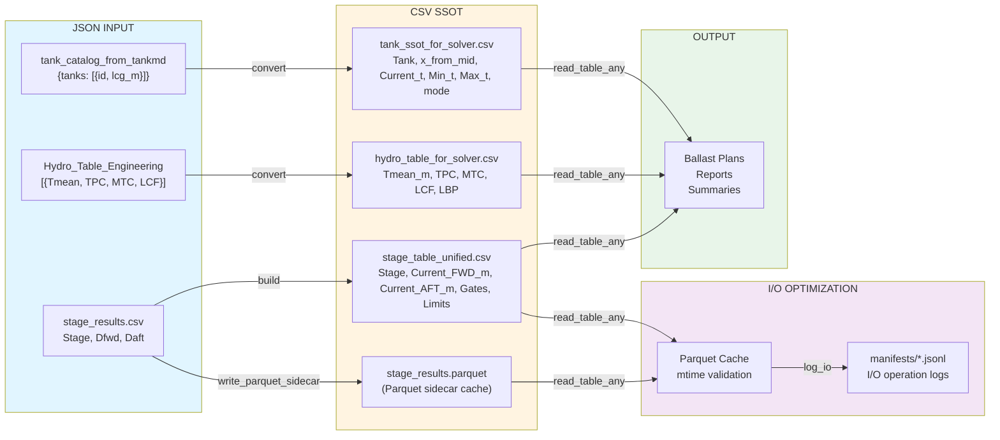
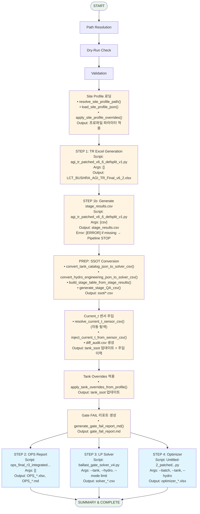
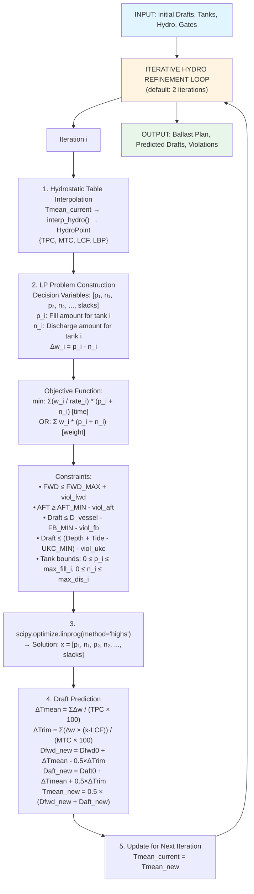
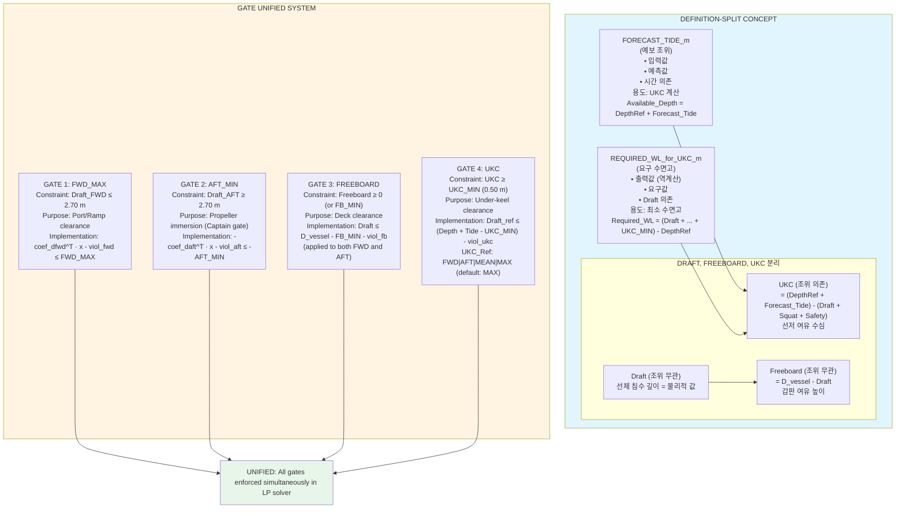
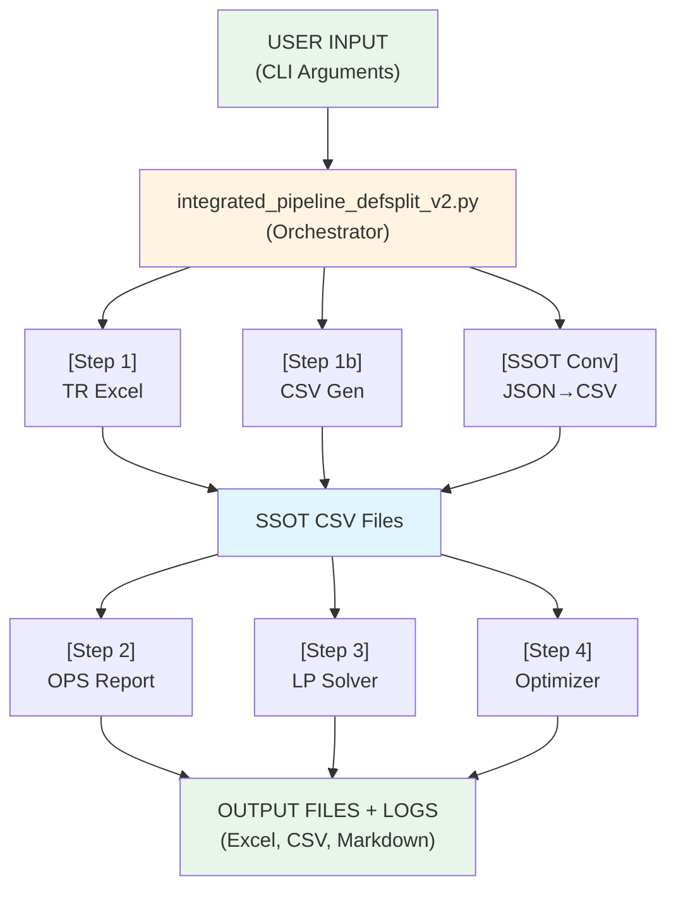

# Ballast Pipeline 시스템 아키텍처 통합 문서

**작성일:** 2025-12-20
**버전:** v3.9 (Updated: 2025-12-29)
**목적:** Ballast Pipeline의 전체 시스템 아키텍처 통합 개요

**최신 업데이트 (v3.9 - 2025-12-29):**
- 입력 데이터 소스 및 탐색 순서 추가 (bplus_inputs 폴더 구조)
- 파이프라인 단계별 입력 파일 매핑 상세화
- Tide Integration 우선순위 명시

**최신 업데이트 (v3.8 - 2025-12-29):**
- 파이프라인 실행 파일 전체 목록 추가 (21개 파일, 카테고리별 분류)
- 컴포넌트 인터페이스 맵 확장 (Step 0, Step 5, 후처리, 유틸리티 포함)
- 실행 방식별 분류 (subprocess, import 모듈, 동적 import)
- 활성화 조건 및 의존성 관계 명시

**최신 업데이트 (v3.7 - 2025-12-29):**
- Forecast_Tide_m 우선순위 변경: CLI `--forecast_tide` 값이 최우선 적용
  - `stage_table_unified.csv`와 `solver_ballast_summary.csv` 간 `Forecast_Tide_m` 완전 일치 보장
  - 자세한 내용: `17_TIDE_UKC_Calculation_Logic.md` 섹션 17.6.5 참조

**최신 업데이트 (v3.6 - 2025-12-28):**
- Option 2 구현: BALLAST_SEQUENCE 옵션/실행 분리
  - `BALLAST_OPTION.csv`: 계획 레벨 (Delta_t 중심, Priority, Rationale 포함)
  - `BALLAST_EXEC.csv`: 실행 시퀀스 (Start_t/Target_t carry-forward, Stage 6B 제외)
  - `generate_sequence_with_carryforward()`: 탱크 상태 추적 및 체인 구현
  - `generate_option_plan()`: 옵션 계획 생성 (모든 Stage 포함)
  - Excel export에 "Ballast_Option" 및 "Ballast_Exec" 시트 추가
- Option 1 패치 제안 (미구현)
  - Bryan Pack Forecast_tide_m 주입 (pipeline_stage_QA.csv 병합)
  - Stage 5_PreBallast GateB critical 강제 (AGI 규칙)
  - Current_* vs Draft_* 단일화 (QA 테이블)

**최신 업데이트 (v3.5 - 2025-12-27):**
- `tide/tide_ukc_engine.py` SSOT 엔진 문서화 추가
- Tide Integration Option B Hybrid 문서화 (3-tier fallback: tide_windows → stage_schedule → constant)
- 백업 폴더 README 업데이트 (실제 파일 목록 반영, spmt/ 디렉토리 파일 상세)
- 컴포넌트 인터페이스 맵에 tide_ukc_engine.py 추가

**이전 업데이트 (v3.4 - 2025-12-27):**
- Tide Integration (AGI-only): Pre-Step tide stage mapping, stage-wise Forecast_tide_m
- UKC 계산 고도화: Tide-dependent UKC, Tide_required_m 역계산, Tide_margin_m, Tide_verdict
- AUTO-HOLD Warnings: Holdpoint stages (Stage 2, Stage 6A_Critical) 자동 경고
- Consolidated Excel: TIDE_BY_STAGE sheet 자동 생성
- SPMT Integration: spmt_unified.py, spmt_integrated_excel.py, Bryan template 통합
- Step 5 추가: Bryan Template Generation (SPMT cargo 포함)

**최신 업데이트 (v3.3 - 2025-12-27):**
- AGENTS.md SSOT 통합 (좌표계, Gate 정의, Tank Direction SSOT)
- 좌표계 상수 및 변환 공식 명확화 (Frame↔x 변환, 부호 규칙)
- Tank Direction SSOT 추가 (FWD/AFT Zone 분류, Golden Rule)
- Gate 정의 명확화 (Gate-A: AFT_MIN_2p70, Gate-B: FWD_MAX_2p70_critical_only)
- Draft vs Freeboard vs UKC 구분 명확화

**최신 업데이트 (v3.2 - 2025-12-27):**
- SSOT Stage 정의 통합 (AGI 전용, stage_results.csv SSOT 강제)
- Preballast fallback 개선 (preballast_min_t 사용, 더 안전한 fallback)
- FR_PREBALLAST 안전화 (22.0으로 변경, extreme aft 방지)
- One-time warning 로직 (misconfiguration 조기 감지)

**최신 업데이트 (v3.1 - 2025-12-27):**
- Current_t 자동 탐색 기능 (current_t_*.csv 패턴 자동 감지)
- diff_audit.csv 생성 (센서 주입 이력 기록)
- GM 검증 v2b (CLAMP 감지, FSM 상태 확인, VERIFY_CLAMP_RANGE/VERIFY_FSM_MISSING)
- GM Grid 축 정렬 (DISP×TRIM 표준화, grid_axis 메타데이터)

**최신 업데이트 (v3.0 - 2025-12-25):**
- SSOT Phase 1 통합 (ssot/ 모듈 - gates_loader, draft_calc, validators)
- B-1 Critical Patches (Pump capability, Tank operability)
- P0/P1 Phase 완료 (Sequence generator, B+ Preflight, Hold point, Valve lineup)
- Modified Option 4 전략 (Forward Inventory: FWB2 28.50t/side)
- Excel Formula Preservation (COM post-processing)
- Step 4b 추가 (Ballast Sequence Generation)

---

## 목차

1. [시스템 개요](#1-시스템-개요)
2. [전체 아키텍처 다이어그램](#2-전체-아키텍처-다이어그램)
3. [데이터 흐름 아키텍처](#3-데이터-흐름-아키텍처)
4. [실행 흐름 아키텍처](#4-실행-흐름-아키텍처)
5. [LP Solver 아키텍처](#5-lp-solver-아키텍처)
6. [Definition-Split & Gates 아키텍처](#6-definition-split--gates-아키텍처)
7. [컴포넌트 인터페이스 맵](#7-컴포넌트-인터페이스-맵)
8. [파이프라인 실행 파일 목록](#8-파이프라인-실행-파일-목록)

---

## 1. 시스템 개요

### 1.1 목적

Ballast Pipeline은 선박의 **Ballast Management** 작업을 자동화하고 최적화하기 위한 통합 파이프라인입니다.

**핵심 기능:**
- SSOT (Single Source of Truth): Gate/Tank/Site profile 통합 관리
- Definition Split: 조위 예보와 요구 수면고의 명확한 분리
- Gate Unified System: FWD/AFT/Freeboard/UKC 게이트 동시 강제
- Linear Programming 기반 최적화
- 6개 독립 단계의 순차 실행 자동화 (Step 1~5)
- 운영 준비: Sequence/Checklist/Valve lineup 자동 생성
- B+ Preflight: 입력 데이터 무결성 사전 검증
- Hold Point: 실시간 측정 기반 재계산
- Forward Inventory: AFT draft 제어 전략
- Current_t 자동 탐색: 센서 CSV 파일 자동 감지 및 주입
- diff_audit.csv: 센서 주입 이력 자동 기록
- GM 검증 고도화: CLAMP 범위 감지, FSM 계수 검증, GM_eff 계산
- **Tide Integration (AGI-only)**: Stage-wise tide mapping, UKC 계산, AUTO-HOLD warnings
- **SPMT Integration**: Cargo input generation, Bryan template 통합
- **Consolidated Excel**: TIDE_BY_STAGE sheet 자동 생성
- **I/O Optimization (PR-01~05)**: Polars lazy scan, Parquet cache, Manifest logging
- **MAMMOET Calculation Sheet**: Technical calculation document generator

### 1.2 주요 특징

- **AGI-Specific**: AGI 사이트 전용 파이프라인 (파라미터는 profile JSON으로 관리)
- **SSOT Integration**: JSON Schema 기반 검증, 단일 소스 진실 원칙
- **Iterative Refinement**: Hydrostatic Table 재보간으로 정확도 향상
- **Definition-Split Enforcement**: Draft/Freeboard/UKC 개념 분리
- **Production Ready**: 재현성 100%, Modified Option 4 검증 완료

---

## 2. 전체 아키텍처 다이어그램

```mermaid
graph TB
    subgraph Input["INPUT LAYER (JSON SSOT + Sensors + Tide)"]
        TankJSON["tank_catalog_AGI_with_operability.json<br/>{tanks: [{operability, pump_access}]}"]
        SiteProfile["site_profile_AGI.json<br/>{gates, pump_scenarios, overrides}"]
        HydroJSON["Hydro_Table_Engineering.json"]
        SensorData["sensors/current_t_sensor.csv<br/>(Modified Option 4:<br/>FWB2 P/S = 28.50t)"]
        ValveMap["valve_map.json"]
        TideTable["bplus_inputs/water tide_202512.xlsx<br/>(AGI-only: time-series tide)"]
        TideWindows["bplus_inputs/tide_windows_AGI.json<br/>(AGI-only: stage time windows)"]
    end

    subgraph SSOTLayer["SSOT MODULE LAYER"]
        GatesLoader["ssot/gates_loader.py<br/>• Gate definitions (AFT_MIN_2p70, FWD_MAX_2p70_critical_only)<br/>• Tank operability<br/>• Ballast plan validation"]
        DraftCalc["ssot/draft_calc.py<br/>• AGENTS.md Method B<br/>• LCF/LBP-based drafts"]
        Validators["ssot/validators.py<br/>• B+ Preflight validation"]
    end

    subgraph IOLayer["I/O OPTIMIZATION LAYER (PR-01~05)"]
        Manifest["perf_manifest.py<br/>• Subprocess-safe JSONL logging<br/>• Run ID based manifest files<br/>• I/O operation tracking"]
        Detect["io_detect.py<br/>• 1-pass encoding detection<br/>• Delimiter auto-inference"]
        FastCSV["io_csv_fast.py<br/>• Polars lazy scan (priority)<br/>• pandas fallback (pyarrow/c/python)<br/>• Manifest logging"]
        ParquetCache["io_parquet_cache.py<br/>• Parquet sidecar cache<br/>• mtime-based validation<br/>• Cache hit/miss logging<br/>• read_table_any() unified API"]
    end

    subgraph Orchestrator["ORCHESTRATOR (Single Entry Point)"]
        MainPipeline["integrated_pipeline_defsplit_v2_gate270_split_v3.py"]
        BPreflight["B+ Preflight (P1-1)<br/>• Input/Physics/Gate/SSOT validation"]
        PreStepTide["Pre-Step: Tide Stage Mapping (AGI-only)<br/>• tide_stage_mapper.py<br/>• tide/tide_ukc_engine.py (SSOT)<br/>• stage_tide_AGI.csv"]
        Step1["Step 1: TR Excel + SSOT gates"]
        Step1b["Step 1b: stage_results.csv<br/>• Merges stage_tide_AGI.csv"]
        SSOTConv["SSOT Conversion<br/>• Tank catalog → CSV<br/>• Hydro table → CSV<br/>• Stage table build (with Tide data)<br/>• Forward Inventory (AFT-min)"]
        SSOTCSV["SSOT CSV LAYER<br/>• tank_ssot_for_solver.csv<br/>• tank_ssot_for_solver__aftmin.csv<br/>• hydro_table_for_solver.csv<br/>• stage_table_unified.csv<br/>• stage_tide_AGI.csv (AGI-only)"]
    end

    subgraph Steps["EXECUTION STEPS"]
        Step2["Step 2: OPS Report"]
        Step3["Step 3: LP Solver<br/>• Operability enforcement<br/>• Pump scenario<br/>• DISCHARGE_ONLY bounds<br/>• UKC calculation (tide-dependent)<br/>• Tide_required_m, Tide_margin_m, Tide_verdict"]
        Step4["Step 4: Optimizer"]
        Step4b["Step 4b: Sequence Generator (P0-2, Option 2)<br/>• ballast_sequence_generator.py<br/>• generate_option_plan()<br/>• generate_sequence_with_carryforward()<br/>Output: BALLAST_OPTION.csv, BALLAST_EXEC.csv"]
        ValveLineup["Valve Lineup (P1-3)<br/>• valve_lineup_generator.py<br/>Output: BALLAST_SEQUENCE_WITH_VALVES.md"]
        Step5SPMT["Step 5a: SPMT Integration<br/>• spmt_unified.py integrate<br/>• SPMT_Integrated_Complete.xlsx"]
        Step5Bryan["Step 5b: Bryan Template<br/>• bryan_template_unified.py<br/>• Bryan_Submission_Data_Pack_*.xlsx"]
        ExcelConsolidation["Step 5c: Excel Consolidation<br/>• TIDE_BY_STAGE sheet<br/>• BC-BR columns update"]
        COMFinalize["Step 6: COM Finalization<br/>• ballast_excel_finalize.py<br/>• RefreshAll + CalculateFullRebuild<br/>• Calc_Log sheet"]
    end

    Input --> SSOTLayer
    SSOTLayer --> IOLayer
    IOLayer --> MainPipeline
    MainPipeline --> BPreflight
    BPreflight -->|PASS/WARN| PreStepTide
    PreStepTide -->|AGI-only| Step1
    Step1 --> Step1b
    Step1b --> SSOTConv
    SSOTConv --> SSOTCSV
    SSOTCSV --> Step2
    SSOTCSV --> Step3
    SSOTCSV --> Step4
    Step3 --> Step4b
    Step4b --> ValveLineup
    ValveLineup --> Step5SPMT
    Step5SPMT --> Step5Bryan
    Step5Bryan --> ExcelConsolidation
    ExcelConsolidation --> COMFinalize

    style Input fill:#e1f5ff
    style SSOTLayer fill:#fff4e1
    style IOLayer fill:#f3e5f5
    style Orchestrator fill:#ffe1e1
    style Steps fill:#e8f5e9
```



---

## 3. 데이터 흐름 아키텍처



---

## 4. 실행 흐름 아키텍처



---

## 5. LP Solver 아키텍처



---

## 6. Definition-Split & Gates 아키텍처



---

## 7. 컴포넌트 인터페이스 맵

```
┌─────────────────────────────────────────────────────────────────────────┐
│                    COMPONENT INTERFACE MAP                              │
└─────────────────────────────────────────────────────────────────────────┘

┌─────────────────────────────────────────────────────────────────────┐
│ COMPONENT 1: integrated_pipeline_defsplit_v2.py                     │
│ (Orchestrator)                                                      │
├─────────────────────────────────────────────────────────────────────┤
│                                                                     │
│ Input (CLI):                                                        │
│   --base_dir, --inputs_dir, --out_dir                              │
│   --from_step, --to_step                                           │
│   --fwd_max, --aft_min, --forecast_tide, --depth_ref, --ukc_min    │
│   --pump_rate, --tank_keywords                                     │
│   --dry_run                                                         │
│                                                                     │
│ Functions:                                                          │
│   • convert_tank_catalog_json_to_solver_csv()                      │
│   • convert_hydro_engineering_json_to_solver_csv()                 │
│   • build_stage_table_from_stage_results()                         │
│   • generate_stage_QA_csv()                                        │
│   • step_run_script()                                              │
│   • run_cmd()                                                      │
│                                                                     │
│ Output:                                                             │
│   • ssot/*.csv (SSOT files)                                        │
│   • logs/*.log (execution logs)                                    │
│   • Collected outputs from steps 2/3/4                            │
│                                                                     │
└─────────────────────────────────────────────────────────────────────┘

┌─────────────────────────────────────────────────────────────────────┐
│ COMPONENT 2: agi_tr_patched_v6_6_defsplit_v1.py                    │
│ (TR Excel Generator)                                                │
├─────────────────────────────────────────────────────────────────────┤
│                                                                     │
│ Input (Files):                                                      │
│   • Hydro_Table_Engineering.json                                   │
│   • GM_Min_Curve.json, Acceptance_Criteria.json, etc.              │
│   • bplus_inputs/data/GZ_Curve_Stage_*.json                        │
│                                                                     │
│ Modes:                                                              │
│   • Default: Excel generation                                      │
│   • CSV mode: python script.py csv → stage_results.csv             │
│                                                                     │
│ Output:                                                             │
│   • LCT_BUSHRA_AGI_TR_Final_v6_2.xlsx (Excel mode)                │
│   • stage_results.csv (CSV mode)                                   │
│                                                                     │
└─────────────────────────────────────────────────────────────────────┘

┌─────────────────────────────────────────────────────────────────────┐
│ COMPONENT 3: ops_final_r3_integrated_defs_split_v4.py              │
│ (OPS Integrated Report)                                             │
├─────────────────────────────────────────────────────────────────────┤
│                                                                     │
│ Input (Files):                                                      │
│   • tank_catalog_from_tankmd.json                                  │
│   • stage_results.csv                                              │
│   • Hydro_Table_Engineering.json                                   │
│                                                                     │
│ Output:                                                             │
│   • OPS_FINAL_R3_AGI_Ballast_Integrated.xlsx                      │
│   • OPS_FINAL_R3_Report_Integrated.md                              │
│                                                                     │
│ Features:                                                           │
│   • Engineering-grade calculations                                 │
│   • GM 2D bilinear interpolation                                   │
│   • Frame-based coordinate system                                  │
│                                                                     │
└─────────────────────────────────────────────────────────────────────┘

┌─────────────────────────────────────────────────────────────────────┐
│ COMPONENT 4: ballast_gate_solver_v4.py                             │
│ (LP Solver)                                                         │
├─────────────────────────────────────────────────────────────────────┤
│                                                                     │
│ Input (CLI + Files):                                                │
│   --tank <tank_ssot.csv>                                           │
│   --hydro <hydro_ssot.csv>                                         │
│   --mode limit|target                                               │
│   --stage <stage_table.csv>                                        │
│   --fwd_max, --aft_min, --d_vessel, --fb_min                       │
│   --forecast_tide, --depth_ref, --ukc_min, --ukc_ref               │
│   --iterate_hydro, --prefer_tons                                   │
│   --out_plan, --out_summary, --out_stage_plan                      │
│                                                                     │
│ Core Functions:                                                     │
│   • load_tanks(), load_hydro_table(), load_stage_table()           │
│   • interp_hydro()                                                  │
│   • predict_drafts()                                                │
│   • build_rows()                                                    │
│   • solve_lp()                                                      │
│   • pick_draft_ref_for_ukc(), ukc_value(), required_wl_for_ukc()   │
│                                                                     │
│ Output:                                                             │
│   • Ballast Plan CSV (Tank, Action, Delta_t, PumpTime_h)           │
│   • Summary CSV (Drafts, Violations, UKC, Freeboard)               │
│   • Stage Plan CSV (if --stage provided)                           │
│                                                                     │
└─────────────────────────────────────────────────────────────────────┘

┌─────────────────────────────────────────────────────────────────────┐
│ COMPONENT 5: Untitled-2_patched_defsplit_v1_1.py                   │
│ (Ballast Optimizer)                                                 │
├─────────────────────────────────────────────────────────────────────┤
│                                                                     │
│ Input (CLI + Files):                                                │
│   --batch                                                           │
│   --tank <tank_ssot.csv>                                           │
│   --hydro <hydro_ssot.csv>                                         │
│   --stage <stage_table.csv>                                        │
│   --prefer_time, --prefer_tons                                     │
│   --iterate_hydro                                                   │
│   --out_plan, --out_summary, --bwrb_out, --tanklog_out             │
│   --excel_out                                                       │
│                                                                     │
│ Features:                                                           │
│   • Operational heuristics + LP                                    │
│   • Batch processing for multiple stages                           │
│   • Excel output with detailed logs                                │
│                                                                     │
│ Output:                                                             │
│   • optimizer_ballast_plan.xlsx                                    │
│   • Optional CSV outputs                                           │
│                                                                     │
└─────────────────────────────────────────────────────────────────────┘

┌─────────────────────────────────────────────────────────────────────┐
│ COMPONENT 7: ballast_sequence_generator.py                         │
│ (Ballast Sequence Generator - Option 2)                            │
├─────────────────────────────────────────────────────────────────────┤
│                                                                     │
│ Functions:                                                          │
│   • generate_option_plan() - 옵션 계획 생성 (모든 Stage)           │
│   • generate_sequence_with_carryforward() - 실행 시퀀스 (Start_t/Target_t 체인) │
│   • generate_optional_sequence() - 옵션 Stage 시퀀스 (Stage 6B)    │
│   • export_to_option_dataframe() - 옵션 DataFrame                   │
│   • export_to_exec_dataframe() - 실행 DataFrame                    │
│                                                                     │
│ Input (Function Parameters):                                        │
│   • ballast_plan_df: Solver/optimizer output                       │
│   • profile: SiteProfile with pump rates                           │
│   • stage_drafts: {stage_name: {fwd, aft, trim, ukc}}              │
│   • tank_catalog_df: Tank catalog with Current_t                   │
│   • exclude_optional_stages: bool (default: True)                  │
│                                                                     │
│ Output:                                                             │
│   • BALLAST_OPTION.csv: Stage, Tank, Action, Delta_t, Priority, Rationale │
│   • BALLAST_EXEC.csv: Stage, Step, Tank, Start_t, Target_t, Time_h, Hold_Point │
│   • BALLAST_SEQUENCE.csv: Legacy format (호환성)                   │
│                                                                     │
│ Key Features:                                                       │
│   • Start_t/Target_t carry-forward: tank_state 딕셔너리로 상태 추적 │
│   • Stage 6B 분리: OPTIONAL_STAGES 상수로 실행 시퀀스에서 제외     │
│   • Tank capacity validation: Target_t > Capacity_t 시 클리핑      │
│   • Priority mapping: Critical=1, PreBallast=2, Standard=3, Optional=5 │
│                                                                     │
└─────────────────────────────────────────────────────────────────────┘

┌─────────────────────────────────────────────────────────────────────┐
│ COMPONENT 8: verify_gm_stability_v2b.py                             │
│ (GM & Stability Verification)                                       │
├─────────────────────────────────────────────────────────────────────┤
│                                                                     │
│ Input (CLI + Files):                                                │
│   --fsm_coeff <Tank_FSM_Coeff.json>                                │
│   --gm_grid <LCT_BUSHRA_GM_2D_Grid.json>                          │
│                                                                     │
│ Features:                                                           │
│   • GM 2D Grid bilinear interpolation (DISP×TRIM)                 │
│   • CLAMP range detection (VERIFY_CLAMP_RANGE)                     │
│   • FSM coefficient validation (VERIFY_FSM_MISSING)                │
│   • GM_eff calculation (GM_raw - FSM/Displacement)               │
│                                                                     │
│ Output:                                                             │
│   • gm_stability_verification_v2b.csv                             │
│   • CLAMP summary report                                           │
│                                                                     │
└─────────────────────────────────────────────────────────────────────┘

┌─────────────────────────────────────────────────────────────────────┐
│ COMPONENT 7: tide/tide_ukc_engine.py                               │
│ (Tide/UKC Calculation Engine - SSOT)                                │
├─────────────────────────────────────────────────────────────────────┤
│                                                                     │
│ Purpose:                                                            │
│   SSOT engine for Tide/UKC calculations (Option B Hybrid)          │
│                                                                     │
│ Functions:                                                          │
│   • required_tide_m() - Inverse UKC calculation                    │
│   • ukc_fwd_aft_min() - UKC calculation (FWD/AFT/MEAN/MAX)         │
│   • verify_tide() - Tide verification with guard bands             │
│   • Linear interpolation for stage_schedule fallback               │
│                                                                     │
│ Integration:                                                        │
│   - Used in Step 3 (Ballast Gate Solver) for UKC gate             │
│   - Stage-wise tide assignment (3-tier fallback)                   │
│   - TIDE_BY_STAGE sheet generation (Step 5c)                       │
│                                                                     │
│ Input (Function Parameters):                                        │
│   • depth_ref_m, forecast_tide_m, draft_ref_m                      │
│   • ukc_min_m, squat_m, safety_allow_m                            │
│   • stage_schedule CSV (fallback mode)                             │
│                                                                     │
│ Output:                                                             │
│   • UKC values (FWD/AFT/MIN)                                       │
│   • Required_tide_m (inverse calculation)                          │
│   • Tide_margin_m, Tide_verdict                                    │
│                                                                     │
└─────────────────────────────────────────────────────────────────────┘
```

---

## 8. 파이프라인 실행 파일 목록

**최신 검증일**: 2025-12-29
**총 실행 파일 수**: 21개 (중복 제외, 모듈 포함)

### 8.1 필수 실행 파일 (Main Pipeline Steps)

| Step | 스크립트 파일명 | 기본 경로 | 실행 방식 | 설명 |
|------|---------------|---------|----------|------|
| **Step 0** | `agi_spmt_unified.py` | `spmt v1/agi_spmt_unified.py` | `subprocess` | SPMT cargo 입력 생성 (선택적) |
| **Step 1** | `agi_tr_patched_v6_6_defsplit_v1.py` | `agi_tr_patched_v6_6_defsplit_v1.py` | `subprocess` | TR Excel 생성 (선택적) |
| **Step 1b** | `agi_tr_patched_v6_6_defsplit_v1.py` | 동일 | `subprocess` | `stage_results.csv` 생성 (필수, csv 모드) |
| **Step 2** | `ops_final_r3_integrated_defs_split_v4_patched_TIDE_v1.py` | `ops_final_r3_integrated_defs_split_v4_patched_TIDE_v1.py` | `subprocess` | OPS Integrated 리포트 (Excel + MD) |
| **Step 3** | `ballast_gate_solver_v4_TIDE_v1.py` | `tide/ballast_gate_solver_v4_TIDE_v1.py` | `subprocess` | Ballast Gate Solver (LP) |
| **Step 4** | `Untitled-2_patched_defsplit_v1_1.py` | `Untitled-2_patched_defsplit_v1_1.py` | `subprocess` | Ballast Optimizer (선택적) |
| **Step 5** | `bryan_template_unified_TIDE_v1.py` | `tide/bryan_template_unified_TIDE_v1.py` | `subprocess` | Bryan Template 생성 및 채움 |

### 8.2 선택적 실행 파일 (Optional Steps)

| Step | 스크립트 파일명 | 기본 경로 | 실행 방식 | 활성화 조건 |
|------|---------------|---------|----------|------------|
| **Step 4b** | `ballast_sequence_generator.py` | `ballast_sequence_generator.py` | `import` (모듈) | `--enable-sequence` |
| **Step 4b** | `checklist_generator.py` | `checklist_generator.py` | `import` (모듈) | `--enable-sequence` |
| **Step 4c** | `valve_lineup_generator.py` | `valve_lineup_generator.py` | `import` (모듈) | `--enable-valve-lineup` |

### 8.3 의존 실행 파일 (Dependencies)

| 부모 스크립트 | 의존 스크립트 | 기본 경로 | 실행 방식 | 설명 |
|-------------|-------------|---------|----------|------|
| `bryan_template_unified_TIDE_v1.py` | `create_bryan_excel_template_NEW.py` | `create_bryan_excel_template_NEW.py` | `subprocess` | Bryan Template 생성 (Step 5 내부) |
| `bryan_template_unified_TIDE_v1.py` | `populate_template.py` | `populate_template.py` | `import` (임베디드) | Template 채움 로직 (Step 5 내부) |

### 8.4 후처리 실행 파일 (Post-Processing)

| 스크립트 파일명 | 기본 경로 | 실행 방식 | 활성화 조건 | 설명 |
|---------------|---------|----------|------------|------|
| `excel_com_recalc_save.py` | `tide/excel_com_recalc_save.py` | `subprocess` | `EXCEL_COM_RECALC_OUT` 환경 변수 설정 시 | Excel 수식 재계산 (COM) |
| `ballast_excel_finalize.py` | `tide/ballast_excel_finalize.py` | `subprocess` | 파일 존재 시 자동 실행 | Excel 수식 최종화 |

### 8.5 유틸리티 실행 파일 (Utilities)

| 스크립트 파일명 | 기본 경로 | 실행 방식 | 활성화 조건 | 설명 |
|---------------|---------|----------|------------|------|
| `compile_headers_registry.py` | `compile_headers_registry.py` | `import` (동적) | `HEADERS_MASTER.xlsx` 존재 시 자동 실행 | HEADERS_MASTER.xlsx → headers_registry.json 컴파일 |
| `debug_report.py` | `debug_report.py` | `import` (동적) | `--debug_report` 또는 `--auto_debug_report` | 디버그 리포트 생성 (선택적) |

### 8.6 모듈 의존성 (Module Dependencies)

| 모듈 경로 | 사용 위치 | 실행 방식 | 설명 |
|---------|---------|----------|------|
| `ssot.gates_loader` | Step 4b | `import` | `SiteProfile`, `load_agi_profile` (프로파일 로딩) |
| `ssot.data_quality_validator` | Step 3, Step 4b | `import` | `DataQualityValidator` (Tidying First Implementation) |
| `tide.tide_ukc_engine` | 여러 Step | `import` | Tide/UKC 계산 SSOT 엔진 |
| `tide.tide_constants` | 여러 Step | `import` | Tide/UKC 상수 |

### 8.7 Pre-Step 실행 파일 (선택적)

| 스크립트 파일명 | 기본 경로 | 실행 방식 | 활성화 조건 | 설명 |
|---------------|---------|----------|------------|------|
| `tide_stage_mapper.py` | `tide_stage_mapper.py` | 수동 실행 (Pre-Step) | `--tide_windows` 제공 시 | Stage별 조위 매핑 (AGI-only) |

### 8.8 실행 파일 통계

| 카테고리 | 개수 | 비고 |
|---------|------|------|
| **필수 실행 파일 (subprocess)** | 4개 | Step 1b, Step 2, Step 3 (항상 실행) |
| **선택적 실행 파일 (subprocess)** | 3개 | Step 0, Step 1, Step 4, Step 5 |
| **선택적 실행 파일 (import 모듈)** | 3개 | Step 4b, Step 4c |
| **의존 실행 파일** | 2개 | Bryan Template 내부 호출 |
| **후처리 실행 파일** | 2개 | Excel 최종화 |
| **유틸리티 실행 파일** | 2개 | Headers registry 컴파일, Debug report |
| **모듈 의존성** | 4개 | SSOT 모듈들 (import) |
| **Pre-Step 실행 파일** | 1개 | Tide mapping (수동 실행) |
| **총계** | **21개** | (중복 제외, 모듈 포함) |

### 8.9 실행 파일 → 출력 파일 → 헤더 매핑

**주요 매핑**:

| 실행 파일 | 출력 파일 | 주요 헤더 구조 |
|---------|---------|-------------|
| `agi_spmt_unified.py` | `AGI_SPMT_Shuttle_Output.xlsx` | Stage_Summary (6개), Stage_Loads (6개), Stage_Results (8개) |
| `agi_tr_patched_v6_6_defsplit_v1.py` | `LCT_BUSHRA_AGI_TR_Final_v*.xlsx` | Ballast_Tanks (6개), Hydro_Table (12개), Hourly_FWD_AFT_Heights (14개) |
| `ops_final_r3_integrated_defs_split_v4_patched_TIDE_v1.py` | `OPS_FINAL_R3_AGI_Ballast_Integrated.xlsx` | Stage_Calculations (37개), Tank_SSOT (11개) |
| `ballast_gate_solver_v4_TIDE_v1.py` | `solver_ballast_summary.csv` | 8개 Tide 컬럼 (TIDE_v1) |
| `ballast_sequence_generator.py` | `BALLAST_EXEC.csv` | 17개 컬럼 (Stage, Step, Tank, Action, Start_t, Target_t, Delta_t 등) |
| `bryan_template_unified_TIDE_v1.py` | `Bryan_Submission_Data_Pack_Populated.xlsx` | 07_Stage_Calc (Row 20, 33-35개 컬럼) |

**참고**:
- 모든 실행 파일은 `integrated_pipeline_defsplit_v2_gate270_split_v3_auditpatched_autodetect_TIDE_v1.py`에서 `step_run_script()`, `subprocess.run()`, 또는 동적 `import`로 호출됩니다.
- 스크립트 경로는 `resolve_script_path()` 함수로 자동 탐색됩니다 (`tide/` 디렉토리에서 실행해도 상위 폴더 스크립트 자동 인식).
- 상세 아키텍처는 `파이프라인 전체 아키텍처, 실행 파일, 로직 상세 설명.MD` 섹션 2.11 참조.

---

## 9. 데이터 스키마 요약

### 8.1 Tank SSOT CSV Schema

```
Tank (str), Capacity_t (float), x_from_mid_m (float, +AFT/-FWD),
Current_t (float), Min_t (float), Max_t (float),
mode (str: "FILL_DISCHARGE"|"FILL_ONLY"|"DISCHARGE_ONLY"|"BLOCKED"|"FIXED"),
use_flag (str: "Y"|"N"),
pump_rate_tph (float), priority_weight (float, lower = higher priority)
```

### 8.2 Hydro Table SSOT CSV Schema

```
Tmean_m (float, sorted ascending), TPC_t_per_cm (float),
MTC_t_m_per_cm (float), LCF_m (float, +AFT/-FWD), LBP_m (float)
```

### 8.3 Stage Table SSOT CSV Schema

```
Stage (str),
Current_FWD_m (float), Current_AFT_m (float),
FWD_MAX_m (float), AFT_MIN_m (float),
FWD_Limit_m (float, Optimizer), AFT_Limit_m (float, Optimizer),
Trim_Abs_Limit_m (float, Optimizer),
D_vessel_m (float, optional),
Forecast_Tide_m (float, optional), DepthRef_m (float, optional),
UKC_Min_m (float, optional)
```

---

## 10. 입력 데이터 소스 및 탐색 순서 (v3.9 신규)

**최신 업데이트**: 2025-12-29
**목적**: 파이프라인 입력 데이터 소스 및 탐색 순서 명확화

### 10.1 bplus_inputs 폴더 구조

```
01_EXECUTION_FILES/bplus_inputs/
├── data/                                    # Frame ↔ x 변환 데이터
│   └── Frame_x_from_mid_m.json            # Frame 좌표계 변환 테이블
│
├── profiles/                                # Site profile
│   └── AGI.json                            # AGI site profile (기본)
│
├── stage_schedule.csv                      # Stage별 타임스탬프 (tide 보간용)
├── tide_windows_AGI.json                  # Stage별 tide window 정의
├── water tide_202512.xlsx                  # Tide 데이터 (Excel, 2025-12)
│
├── Hydro_Table_Engineering.json           # Hydrostatic 테이블 (엔지니어링 버전)
├── LCT_BUSHRA_GM_2D_Grid.json            # GM 2D Grid (GM 검증용)
├── Tank_FSM_Coeff.json                    # FSM 계수 (GM 검증용)
│
├── Acceptance_Criteria.json               # 승인 기준
├── GM_Min_Curve.json                      # GM 최소 곡선
├── ISCODE_Criteria.json                   # ISCODE 기준
├── Securing_Input.json                    # 고정 입력
└── Structural_Limits.json                 # 구조적 제한
```

### 10.2 파이프라인 단계별 입력 파일 매핑

| Step | 입력 파일 | 경로 | 사용 목적 | 필수 여부 |
|------|----------|------|----------|----------|
| **Step 1** (TR Excel) | `Hydro_Table_Engineering.json` | `bplus_inputs/` | Hydrostatic 데이터 | 필수 |
| | `data/Frame_x_from_mid_m.json` | `bplus_inputs/data/` | Frame ↔ x 변환 | 필수 |
| **Step 2** (OPS) | `profiles/AGI.json` | `bplus_inputs/profiles/` | Site profile (자동 탐색) | 필수 |
| | `Hydro_Table_Engineering.json` | `bplus_inputs/` | Hydrostatic 데이터 | 필수 |
| **Step 2** (Tide Integration) | `stage_schedule.csv` | `bplus_inputs/` | Stage별 타임스탬프 (tide 보간용) | 선택적 |
| | `water tide_202512.xlsx` | `bplus_inputs/` | Tide 데이터 (Excel) | 선택적 |
| | `tide_windows_AGI.json` | `bplus_inputs/` | Stage별 tide window 정의 | 선택적 |
| **Step 3** (Solver) | `Hydro_Table_Engineering.json` | `bplus_inputs/` | Hydrostatic 데이터 (간접) | 필수 |
| **Step 5** (Post-processing) | `LCT_BUSHRA_GM_2D_Grid.json` | `bplus_inputs/` | GM 2D Grid (GM 검증) | 선택적 |
| | `Tank_FSM_Coeff.json` | `bplus_inputs/` | FSM 계수 (GM 검증) | 선택적 |

### 10.3 탐색 순서 및 우선순위

**파이프라인 탐색 순서**:
1. `inputs_dir/bplus_inputs/` (또는 `base_dir/bplus_inputs/`)
2. `02_RAW_DATA/` (fallback)

**Tide Integration 우선순위 (5-tier)**:
1. **Priority 0**: CLI `--forecast_tide` (최우선)
2. **Priority 1**: `stage_tide_csv` (예: `stage_tide_AGI.csv`)
3. **Priority 2**: `tide_table` + `stage_schedule` 보간
   - `water tide_202512.xlsx` + `stage_schedule.csv`
4. **Priority 3**: `tide_windows_AGI.json` (선택적)
5. **Priority 4**: Profile fallback 또는 기본값

**참고**:
- 자세한 내용은 `파이프라인 전체 아키텍처, 실행 파일, 로직 상세 설명.MD` 섹션 2.12 참조.
- Tide Integration 상세는 `17_TIDE_UKC_Calculation_Logic.md` 섹션 17.6 참조.

---

## 11. 주요 상수 및 파라미터 (SSOT - AGENTS.md 기준)

### 9.1 좌표계 상수 (SSOT - 재해석 금지)

**Frame 좌표계 (BUSHRA TCP / tank.md 기준)**:
- `Fr.0 = AP (AFT)`: After Perpendicular (선미 수직선)
- `Frame 증가 방향 = FWD`: Frame이 증가할수록 선수 방향
- `Frame 30.151 = Midship → x = 0.0`: Midship 기준점

**X 좌표계 (계산용, Midship 기준)**:
- `LPP_M = 60.302`: Length between perpendiculars (m)
- `MIDSHIP_FROM_AP_M = 30.151`: Midship 위치 (AP 기준, m)
- `_FRAME_SLOPE = -1.0`: Frame→x 변환 기울기
- `_FRAME_OFFSET = 30.151`: Frame→x 변환 오프셋

**좌표 변환 공식 (표준, 재해석 금지)**:
```
x = _FRAME_SLOPE * (Fr - _FRAME_OFFSET)
x = 30.151 - Fr
```

**X 좌표 부호 규칙**:
- `x > 0`: AFT (선미 방향)
- `x < 0`: FWD (선수 방향)

**Golden Rule**: 선수 탱크(높은 Fr / 높은 LCG(AP))를 "선미 ballast"로 취급하면 물리 법칙이 뒤집혀 모든 Gate가 깨집니다.

### 9.2 Tank Direction SSOT (FWD/AFT 분류 - 재논의 금지)

**AFT Zone (선미)**:
- `FW2 P/S`: Fr.0-6 (선미 담수)
- `VOIDDB4 P/S`, `SLUDGE.C`, `SEWAGE.P`: Fr.19-24 (중선미)
- 연료 탱크 `DO`, `FODB1`, `FOW1`, `LRFO P/S/C`: Fr.22-33 (Midship 근처)

**MID Zone**:
- `VOID3 P/S`: Fr.33-38

**MID-FWD Zone**:
- `FWCARGO2 P/S`: Fr.38-43
- `FWCARGO1 P/S`: Fr.43-48

**FWD/BOW Zone (선수)**:
- `FWB2 P/S`: Fr.48-53 (선수 ballast)
- `VOIDDB1.C`: Fr.48-56
- `FWB1 P/S`: Fr.56-FE (선수 ballast)
- `CL P/S`: Fr.56-59 (Chain lockers)

**실무적 결과**: `FWB1.*` 및 `FWB2.*`는 **선수/선수 탱크**입니다. X 좌표계에서 `x < 0`을 가지며, **"선미 ballast"로 사용할 수 없습니다**. AFT-up / stern-down 모멘트가 필요하면 **AFT zone 탱크** 및/또는 화물 LCG를 선미로 이동해야 합니다.

### 9.3 선박 상수 (SSOT)

```
LPP_M = 60.302 m
MIDSHIP_FROM_AP_M = 30.151 m
D_VESSEL_M = 3.65 m (molded depth, freeboard = D - Draft 계산용)
```

### 9.4 기본 게이트 값 (SSOT - AGENTS.md 기준)

**Gate-A (Captain / Propulsion)**:
- `CAPTAIN_AFT_MIN_DRAFT_M = 2.70`: Captain AFT 최소 Draft (m)
- `GATE_A_LABEL = "AFT_MIN_2p70"`: Gate-A 라벨 (모호한 "2.70m" 방지)
- **정의**: AFT draft ≥ 2.70m (비상 시 프로펠러 효율/추진 확보)
- **ITTC 참고**: 승인 문서에는 **shaft centreline immersion** (프로펠러 직경 기준)을 보고해야 함
  - 최소: 1.5D, 권장: 2.0D (D = 프로펠러 직경)

**Gate-B (Mammoet / Critical RoRo only)**:
- `MAMMOET_FWD_MAX_DRAFT_M_CD = 2.70`: Mammoet FWD 최대 Draft (Chart Datum 기준, m)
- `GATE_B_LABEL = "FWD_MAX_2p70_critical_only"`: Gate-B 라벨 (모호한 "2.70m" 방지)
- **정의**: FWD draft (Chart Datum) ≤ 2.70m, **Critical RoRo stages만** 적용
- **Critical Stage 정의**: `DEFAULT_CRITICAL_STAGE_REGEX = r"(preballast.*critical|6a.*critical|stage\s*5.*preballast|stage\s*6a)"`

**Gate Labels SSOT (모호한 "2.70m" 방지)**:
- **절대 "2.70m"만 쓰지 말 것**. 항상 라벨 포함:
  - **Gate-A**: `AFT_MIN_2p70` (Captain / Propulsion)
  - **Gate-B**: `FWD_MAX_2p70_critical_only` (Mammoet / Critical RoRo only)

**기타 게이트**:
- `AFT_MAX_m = 3.50 m` (Optimizer upper limit)
- `Trim_Abs_Limit_m = 0.50 m` (Optimizer)
- `UKC_MIN_m = 0.50 m` (project default)

**Draft vs Freeboard vs UKC 구분 (혼동 금지)**:
- **Draft**: keel → waterline (FWD/AFT/Mean, 조위 무관)
- **Molded depth (D_vessel_m)**: keel → main deck (기하학적)
- **Freeboard**: deck (또는 openings) → waterline (위험: deck wet/downflooding, 조위 무관)
- **UKC**: seabed/chart depth + tide − draft (위험: grounding, 조위 의존)
- **Tide**: **UKC에만 영향**, freeboard에는 영향 없음 (선박은 조수와 함께 상승)

### 9.3 기본 최적화 파라미터

```
iterate_hydro = 2 (iterations)
pump_rate_tph = 100.0 (default)
prefer_time = False (default: weight minimization)
```

---

## 11. 전체 시스템 통합 뷰



---

## 12. Excel/CSV 일관성 보장 메커니즘 (2024-12-23)

### 8.1 배경 및 문제점

**문제 상황:**
- Excel 생성(`create_roro_sheet()`)과 CSV 생성(`export_stages_to_csv()`)이 서로 다른 cfg 사용
- `agi_tr_patched_v6_6_defsplit_v1.py` 내부에 **중복 cfg 섹션** 존재:
  - Line 4070: 구버전 cfg (Excel 생성용)
  - Line 7494: 신버전 cfg (CSV 생성용)

**영향:**
```
Before Patch:
Excel (Step 1)          CSV (Step 1b)
     ↓                       ↓
  cfg (Line 4070)       cfg (Line 7494)
     ↓                       ↓
  FR=17.95 (old)        FR=29.39 (new)
     ↓                       ↓
  x=12.20m              x=0.76m
     ↓                       ↓
Stage 6C Dfwd=4.35m   Stage 6C Dfwd=3.80m
     ↓                       ↓
Excel ≠ CSV (불일치) ❌
```

### 8.2 해결 방안

**아키텍처 변경:**

```
After Patch:
stage_results.csv (SSOT)
         ↓
    x=0.76m (Stage 6C)
         ↓
    ┌────┴────┐
    ↓         ↓
Excel Gen   CSV Gen
    ↓         ↓
Reads CSV   Uses CSV
    ↓         ↓
cfg dynamic cfg dynamic
    ↓         ↓
FR=29.39    FR=29.39
    ↓         ↓
Excel = CSV (일치) ✅
```

**구현 상세:**

**1. create_roro_sheet() 수정 (Excel 생성):**
```python
# agi_tr_patched_v6_6_defsplit_v1.py - Line 4068+
import csv
from pathlib import Path

stage_results_path = Path("stage_results.csv")
if stage_results_path.exists():
    print("[INFO] Reading TR positions from stage_results.csv (SSOT)")
    stage_data = {}
    with open(stage_results_path, 'r', encoding='utf-8') as f:
        for row in csv.DictReader(f):
            x_m = float(row.get('x_stage_m', 0.0))
            stage_data[row['Stage']] = {'x': x_m}

    def x_to_fr(x_m: float) -> float:
        return 30.151 - x_m  # Frame = Midship - x

    cfg = {
        "FR_TR2_STOW": x_to_fr(stage_data['Stage 6C']['x']),
        # x=0.76 → Fr=29.391
    }
```

**2. export_stages_to_csv() cfg 업데이트 (CSV 생성):**
```python
# agi_tr_patched_v6_6_defsplit_v1.py - Line 7494+
cfg = {
    "W_TR": 271.20,
    "FR_TR1_RAMP_START": 26.15,  # Stage 2: x=+4.0m
    "FR_TR1_STOW": 25.65,         # Stage 4/5: x=+4.5m
    "FR_TR2_RAMP": 25.04,         # Stage 6A: x=+5.11m
    "FR_TR2_STOW": 29.39,         # Stage 6C: x=+0.76m (LCF)
    "FR_PREBALLAST": 25.58,       # Stage 5_PreBallast: x=+4.57m
}
```

### 8.3 검증 프로세스

**파이프라인 실행 로그:**
```
[STEP 1] TR Excel Generation
[INFO] Reading TR positions from stage_results.csv (SSOT)
[INFO] cfg from stage_results.csv: {
    'FR_TR2_STOW': 29.391,  # ✅ x=0.76m
}

[STEP 1b] Generate stage_results.csv (TR script csv mode)
(Already exists, skip generation)

[PREP] Build SSOT CSVs
[WARNING] Draft values clipped to D_vessel (3.65m) for 1 stages:
  - Stage 6C: FWD 3.80 -> 3.65m, AFT 3.80 -> 3.65m
```

**Stage 6C 일관성 검증:**

| Source | x_stage_m | Frame | Dfwd (input) | Dfwd (final) | Status |
|--------|-----------|-------|--------------|--------------|--------|
| stage_results.csv | 0.76m | - | 3.80m | 3.65m | ✅ SSOT |
| Excel (cfg) | 0.76m (읽음) | 29.391 | - | - | ✅ Consistent |
| pipeline_stage_QA.csv | - | - | - | 3.65m | ✅ Consistent |

### 8.4 Draft Clipping 메커니즘

**구현 위치:** `build_stage_table_from_stage_results()` - integrated_pipeline

```python
D_vessel_m = 3.65  # LCT BUSHRA molded depth

# Physical constraint enforcement
if dfwd > D_vessel_m:
    print(f"[WARNING] Draft clipped: FWD {dfwd:.2f} -> {D_vessel_m:.2f}m")
    dfwd = D_vessel_m

if daft > D_vessel_m:
    print(f"[WARNING] Draft clipped: AFT {daft:.2f} -> {D_vessel_m:.2f}m")
    daft = D_vessel_m

# Freeboard calculation
freeboard_fwd = D_vessel_m - dfwd
freeboard_aft = D_vessel_m - daft
freeboard_min = min(freeboard_fwd, freeboard_aft)

# Safety check
if freeboard_min < 0.0:
    print(f"[ERROR] Negative freeboard: {freeboard_min:.2f}m")
elif freeboard_min == 0.0:
    print(f"[WARNING] Zero freeboard: Deck edge at waterline")
```

**Stage 6C 예시:**
- Input: Dfwd=3.80m, Daft=3.80m (calculated from x=0.76m, even keel)
- Clipping: 3.80m > 3.65m → clip to 3.65m
- Output: Dfwd=3.65m, Daft=3.65m
- Freeboard: 0.00m (deck edge at waterline) ⚠️

### 8.5 효과 및 이점

**일관성:**
- ✅ Excel과 CSV가 동일한 `stage_results.csv` SSOT 사용
- ✅ TR 위치 데이터 단일화
- ✅ 중복 cfg 제거로 유지보수성 향상

**안전성:**
- ✅ Draft clipping으로 물리적 한계 자동 강제
- ✅ Freeboard 0.00m 자동 감지 및 경고
- ✅ D_vessel 초과 불가능

**운영:**
- ✅ 데이터 불일치로 인한 혼란 제거
- ✅ 운영 의사결정에 신뢰할 수 있는 단일 데이터 제공
- ✅ 시뮬레이션 재현성 보장

---

## 11. Option 1 패치 제안 (AGI 제출 가능성 개선, 미구현)

### 배경

AGI 제출 가능성 검증 결과, 다음 3가지 패치가 필요합니다:

1. **Bryan Pack Forecast_tide_m 주입**
   - 문제: `Bryan_Submission_Data_Pack_Populated.xlsx`의 `07_Stage_Calc`에 `Forecast_tide_m` 미주입
   - 해결: `pipeline_stage_QA.csv`에서 `Forecast_tide_m`을 읽어 `stage_results.csv`에 병합 후 populate
   - 구현 위치: `integrated_pipeline` Step 5 (Bryan Pack 생성 전)

2. **Stage 5_PreBallast GateB Critical 강제**
   - 문제: `Stage 5_PreBallast`가 GateB critical 적용 대상으로 잡히지 않음
   - 해결: `_is_critical_stage()` 함수에 명시적 체크 추가
   - 구현 위치: `integrated_pipeline` Gate 계산 로직

3. **Current_* vs Draft_* 단일화**
   - 문제: `pipeline_stage_QA.csv`에 `Current_*`와 `Draft_*`가 동시 존재하여 혼란
   - 해결: QA 생성 시 `Current_*` 컬럼 제거 또는 `Draft_*`로 통일
   - 구현 위치: `generate_stage_QA_csv()` 함수

**상세 내용:** `02_IMPLEMENTATION_REPORTS/20251228/OPTION1_OPTION2_AGI_SUBMISSION_PATCHES_20251228.md` 참조

---

## 참고 문서

상세 내용은 다음 문서 참조:
- `01_Architecture_Overview.md`: 상세 아키텍처 개요
- `02_Data_Flow_SSOT.md`: 데이터 흐름 및 SSOT 상세
- `03_Pipeline_Execution_Flow.md`: 실행 흐름 상세
- `04_LP_Solver_Logic.md`: LP Solver 수학적 모델
- `Ballast Pipeline 운영 가이드.MD`: 실무 운영 가이드 (프로파일 시스템, 센서 데이터 통합, Gate FAIL 리포트 등 최신 기능 상세)
- `05_Definition_Split_Gates.md`: Definition-Split 및 Gates 상세
- `06_Script_Interfaces.md`: 스크립트 인터페이스 상세

---

**문서 버전:** v3.8 (파이프라인 실행 파일 목록 추가)
**최종 업데이트:** 2025-12-29
**참조 문서**:
- `03_DOCUMENTATION/AGENTS.md` (좌표계, Gate 정의, Tank Direction SSOT)
- `파이프라인 전체 아키텍처, 실행 파일, 로직 상세 설명.MD` (상세 실행 파일 목록)
